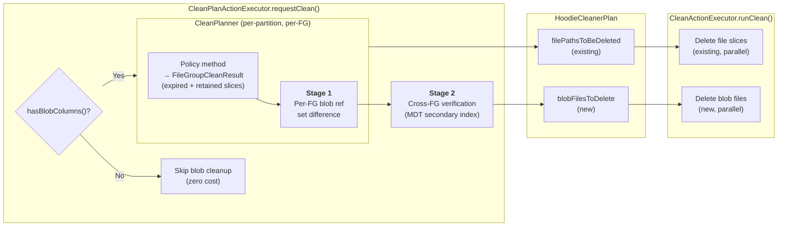
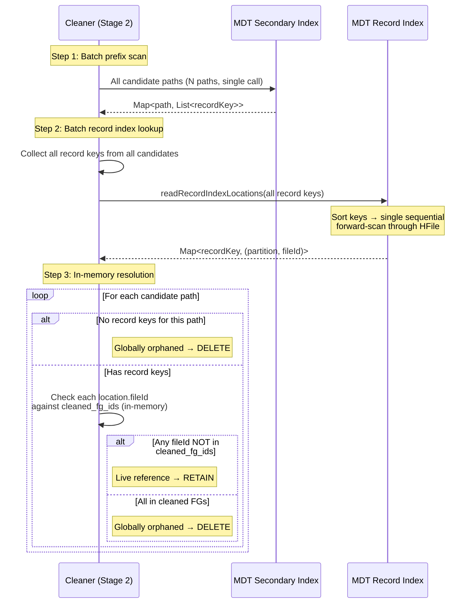
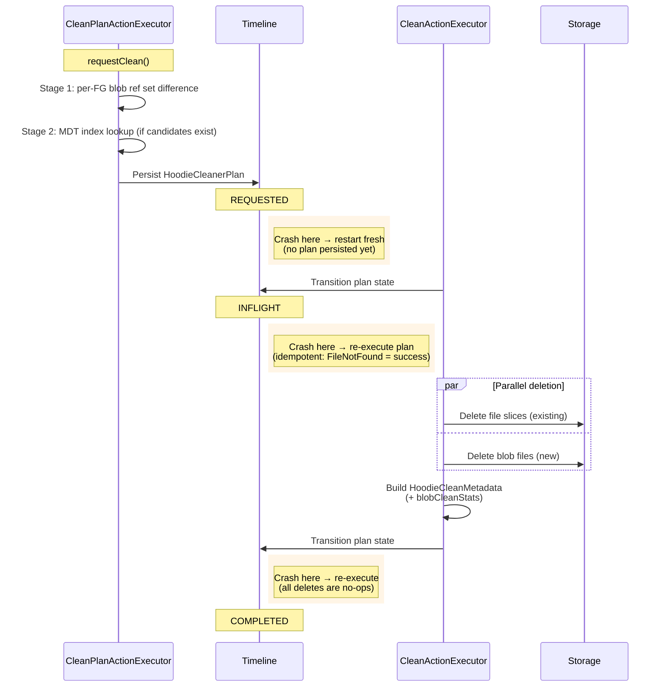
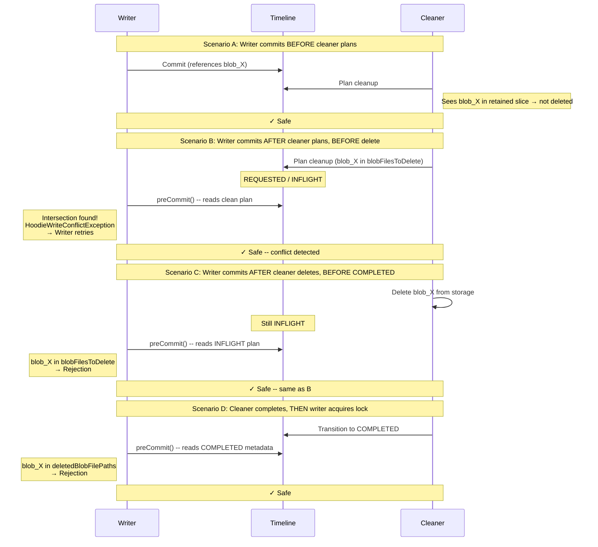

<!--
  Licensed to the Apache Software Foundation (ASF) under one or more
  contributor license agreements.  See the NOTICE file distributed with
  this work for additional information regarding copyright ownership.
  The ASF licenses this file to You under the Apache License, Version 2.0
  (the "License"); you may not use this file except in compliance with
  the License.  You may obtain a copy of the License at

       http://www.apache.org/licenses/LICENSE-2.0

  Unless required by applicable law or agreed to in writing, software
  distributed under the License is distributed on an "AS IS" BASIS,
  WITHOUT WARRANTIES OR CONDITIONS OF ANY KIND, either express or implied.
  See the License for the specific language governing permissions and
  limitations under the License.
-->

# RFC-100 Part 2: External Blob Cleanup for Unstructured Data

## Proposers

- @voon

## Approvers

- @rahil-c
- @vinothchandar
- @yihua

## Status

Issue: <Link to GH feature issue>

> Please keep the status updated in `rfc/README.md`.

---

## Abstract

When Hudi cleans expired file slices, external out-of-line blob files they reference may become
orphaned -- still consuming storage but unreachable by any query. This RFC extends the existing file
slice cleaner to identify and delete these orphaned blob files safely and efficiently. The design
uses a two-stage pipeline: (1) per-file-group set-difference to find locally-orphaned blobs, and
(2) cross-file-group verification via MDT secondary index lookup. Targeted index lookups scale with
the number of candidates, not the table size. Tables without blob columns pay zero cost.

This design focuses on **external blobs** -- the Phase 1 use case of RFC-100 where users have
existing blob files in external storage (e.g., `s3://media-bucket/videos/`) and Hudi manages the
*references* via the `BlobReference` schema, not the *storage layout*.

---

## Background

### Why Blob Cleanup Is Needed

RFC-100 introduces out-of-line blob storage for unstructured data (images, video, documents). A
record's `BlobReference` field points to an external blob file by `reference.external_path`. When
the cleaner expires old file slices, the blob files they reference may no longer be needed -- but the
existing cleaner has no concept of transitive references. It deletes file slices without considering
the blob files they point to. Without blob cleanup, orphaned blobs accumulate indefinitely.

### External Blobs

Users have existing blob files in external storage (e.g., `s3://media-bucket/videos/`). Records
reference these blobs directly by path. Hudi manages the *references*, not the *storage layout*.
Cross-file-group sharing is common -- multiple records across different file groups can point to the
same blob. Key properties:

| Property                  | External blobs                               |
|---------------------------|----------------------------------------------|
| Path uniqueness           | Not guaranteed (user controls)               |
| Cross-FG sharing          | Common (multiple records, same blob)         |
| Writer/cleaner race       | Can occur (external paths outside MVCC)      |
| Per-FG cleanup sufficient | No -- cross-FG verification needed           |

### Constraints and Requirements Reference

Full descriptions and failure modes in [Problem Statement](rfc-100-blob-cleaner-problem.md).

| ID  | Constraint                                          | Remarks                          |
|-----|-----------------------------------------------------|----------------------------------|
| C1  | Blob immutability (append-once, read-many)          |                                  |
| C2  | Delete-and-re-add same path                         | Real concern for external blobs  |
| C3  | Cross-file-group blob sharing                       | Common for external blobs        |
| C4  | MOR log updates shadow base file blob refs          |                                  |
| C5  | Existing cleaner is per-file-group scoped           |                                  |
| C6  | OCC is per-file-group                               | No global contention allowed     |
| C7  | Replace commits move blob refs between file groups  | Clustering, insert_overwrite     |
| C8  | Savepoints freeze file slices and blob refs         |                                  |
| C9  | Rollback and restore can invalidate or resurrect    |                                  |
| C10 | Archival removes commit metadata                    |                                  |
| C11 | Cross-FG verification needed at scale               |                                  |

| ID  | Requirement                                                      |
|-----|------------------------------------------------------------------|
| R1  | No premature deletion (hard invariant)                           |
| R2  | No permanent orphans (bounded cleanup)                           |
| R3  | MOR correctness (over-retention acceptable, under-retention not) |
| R4  | Concurrency safety (no global serialization)                     |
| R5  | Scale proportional to work, not table size                       |
| R6  | No cost for non-blob tables                                      |
| R7  | All cleaning policies supported                                  |
| R8  | Crash safety and idempotency                                     |
| R9  | Observability (metrics for deleted, retained, reclaimed)         |

---

## Design Overview

### Design Philosophy

Blob cleanup extends the existing `CleanPlanner` / `CleanActionExecutor` pipeline -- same timeline
instant, same plan-execute-complete lifecycle, same crash recovery and OCC integration. A
`hasBlobColumns()` check gates all blob logic so non-blob tables pay near zero cost (schema scan 
cost).

External blobs require cross-file-group verification because the same blob can be referenced from
multiple file groups (C3, C11). The design uses targeted MDT secondary index lookups that scale
with the number of candidates, not the table size.

### Two-Stage Pipeline

| Stage       | Scope            | Purpose                                                              | When it runs                 |
|-------------|------------------|----------------------------------------------------------------------|------------------------------|
| **Stage 1** | Per-file-group   | Collect expired/retained blob refs, compute set difference           | Always (for blob tables)     |
| **Stage 2** | Cross-file-group | Verify candidates against MDT secondary index or fallback scan       | When local orphans exist     |

### Key Decisions

| Decision            | Choice                                                  | Rationale                                                      |
|---------------------|---------------------------------------------------------|----------------------------------------------------------------|
| Blob identity       | `reference.external_path`                               | Path-based identity for external blobs                         |
| Cleanup scope       | Per-FG candidate identification + cross-FG verification | Aligns with OCC (C6) and existing cleaner (C5); scales for C11 |
| Cross-FG mechanism  | MDT secondary index on `reference.external_path`        | Short-circuits on first non-cleaned FG ref                     |
| MOR strategy        | Over-retain (union of base + log refs)                  | Safe (C4, R3); cleaned after compaction                        |



---

## Algorithm

### Stage 1: Per-File-Group Local Cleanup

Stage 1 runs after the existing policy logic determines which file slices are expired and retained
for a given file group. It collects blob refs from both sets and computes locally-orphaned blobs by
set difference. All local orphans proceed to Stage 2 for cross-FG verification.

```
Input:  A file group FG with expired_slices and retained_slices (from policy)
Output: local_orphan_candidates -- external blobs needing cross-FG verification

for each file_group being cleaned:

    // Collect expired blob refs (base files + log files)
    // Must read log files: blob refs introduced and superseded within the log
    // chain before compaction would otherwise become permanent orphans.
    expired_refs = Set<external_path>()
    for slice in expired_slices:
        for ref in extractBlobRefs(slice.baseFile):   // columnar projection
            if ref.type == OUT_OF_LINE and ref.managed == true:
                expired_refs.add(ref.external_path)
        for ref in extractBlobRefs(slice.logFiles):   // full record read
            if ref.type == OUT_OF_LINE and ref.managed == true:
                expired_refs.add(ref.external_path)

    if expired_refs is empty:
        continue                                       // no blob work for this FG

    // Collect retained blob refs (base files only)
    // Cleaning is fenced on compaction: retained base files contain the merged
    // state. Log reads are unnecessary -- any shadowed base ref causes safe
    // over-retention, cleaned after the next compaction cycle.
    retained_refs = Set<external_path>()
    for slice in retained_slices:
        for ref in extractBlobRefs(slice.baseFile):   // columnar projection only
            if ref.type == OUT_OF_LINE and ref.managed == true:
                retained_refs.add(ref.external_path)

    // Compute local orphans by set difference
    local_orphans = expired_refs - retained_refs

    // All local orphans proceed to Stage 2 for cross-FG verification
    all_local_orphans.addAll(local_orphans)
```

**Correctness notes:**

- **MOR -- expired side reads base + logs:** Blob refs can be introduced and superseded entirely
  within the log chain (e.g., `log@t2: row1->blob_B`, then `log@t3: row1->blob_C`). After
  compaction, `blob_B` exists only in the expired log. Skipping logs would orphan it permanently.
- **MOR -- retained side reads base only:** Cleaning is fenced on compaction, so retained base
  files contain the merged state. Shadowed base refs cause over-retention (safe), cleaned after
  the next compaction.
- **Savepoints:** Inherited from existing cleaner -- savepointed slices stay in the retained set.
- **Replaced FGs (replace commits):** `retained_slices` is empty, so all blob refs become
  candidates. For external blobs, clustering copies the pointer to the target FG, so Stage 2
  finds the reference in the target FG and retains the blob.

### Stage 2: Cross-File-Group Verification

Stage 2 verifies each local orphan candidate against the global state to determine if the blob is
still referenced by any active file slice outside the cleaned file groups. This is necessary because
external blobs can be shared across file groups (C3, C11).

#### Primary path: MDT secondary index

When the MDT secondary index on `reference.external_path` is available and fully built:

```
Input:  all_local_orphans, cleaned_fg_ids
Output: blob_files_to_delete (confirmed globally orphaned)

candidate_paths = all_local_orphans.distinct()

// Step 1: Batched prefix scan on secondary index
// Key format: escaped(external_path)$escaped(record_key)
// Returns ALL record keys that reference each candidate path
// Uses engine-context HoodieData (e.g., RDD on Spark) to distribute work
// across executors -- candidate sets can be large (row-level blob refs).
candidate_paths_data = engineContext.parallelize(candidate_paths)
path_to_record_keys = mdtMetadata.readSecondaryIndexDataTableRecordKeysWithKeys(
    candidate_paths_data, indexPartitionName)
    .groupBy(pair -> pair.getKey())

// Step 2: Batch record index lookup -- ONE call for ALL record keys
// Sorts keys internally, single sequential forward-scan through HFile.
all_record_keys = path_to_record_keys.values().flatMap()
all_locations = mdtMetadata.readRecordIndexLocations(
    all_record_keys)                                    // -> Map<recordKey, (partition, fileId)>

// Step 3: In-memory resolution with short-circuit per candidate
for path in candidate_paths:
    record_keys = path_to_record_keys.getOrDefault(path, [])

    if record_keys is empty:
        blob_files_to_delete.add(path)                  // globally orphaned
        continue

    found_live_reference = false
    for rk in record_keys:
        location = all_locations.get(rk)
        if location != null and location.fileId NOT in cleaned_fg_ids:
            found_live_reference = true
            break                                       // short-circuit (in-memory)

    if not found_live_reference:
        blob_files_to_delete.add(path)                  // all refs in cleaned FGs
```

**Cost model.** Three steps: (1) batched prefix scan on secondary index, (2) batched record index
lookup in a single sorted HFile scan, (3) in-memory resolution with short-circuit. Steps 1 and 2
are each a single I/O pass; step 3 is pure hash set lookups.

| Step                      | I/O                                           | Estimated cost (2K candidates) |
|---------------------------|-----------------------------------------------|--------------------------------|
| 1. Prefix scan (batched)  | 1 HFile open + forward scan of N prefix keys  | ~2-5s                          |
| 2. Record index (batched) | 1 HFile open + forward scan of 6K sorted keys | ~1-2s                          |
| 3. In-memory resolution   | Hash set checks (cleaned_fg_ids)              | ~0ms                           |

*Estimates assume cloud object storage (S3/GCS/ADLS), ~10-100ms per-read latency, ~50-200 MB/s
sequential throughput, 64-256KB HFile blocks. Pending benchmarking.*

**Index definition.** Uses the existing `HoodieIndexDefinition` mechanism with
`sourceFields = ["<blob_col>", "reference", "external_path"]`. The nested field path is supported
by `HoodieSchemaUtils.projectSchema()` and `SecondaryIndexRecordGenerationUtils`. No new index
infrastructure is needed.

**Safety check.** The cleaner verifies the index is fully built before using it via
`getMetadataPartitions()` and `getMetadataPartitionsInflight()`. A partially-built index falls
back to the table scan path.

#### Fallback path: table scan with circuit breaker

When the MDT secondary index is unavailable, Stage 2 falls back to a parallelized table scan
across all partitions. A circuit breaker (`hoodie.cleaner.blob.external.scan.max.candidates`,
default 1000) defers cleanup if candidates exceed the threshold, preventing the scan from becoming
a bottleneck on large tables. The operator is warned to enable the MDT secondary index.

#### Decision matrix

| Condition                   | Path used     | Cost                  | Suitable for              |
|-----------------------------|---------------|-----------------------|---------------------------|
| No local orphan candidates  | Skip Stage 2  | Zero                  | No blob work this cycle   |
| MDT secondary index enabled | Index lookup  | O(candidates)         | Any scale                 |
| No index, few candidates    | Table scan    | O(candidates * table) | Small tables              |
| No index, many candidates   | Circuit break | Zero (deferred)       | Large tables need index   |



### Execution Flow

```
1. CleanPlanActionExecutor.requestClean()
   ├── hasBlobColumns(table)?                         // R6: zero-cost gate
   ├── CleanPlanner: for each partition, for each file group:
   │     ├── Refactored policy method -> FileGroupCleanResult
   │     └── If hasBlobColumns: Stage 1 per FG
   ├── CleanPlanner: replaced file groups -> Stage 1
   ├── If local orphan candidates non-empty: Stage 2
   ├── Build HoodieCleanerPlan (+ blobFilesToDelete)
   └── Persist plan to timeline (REQUESTED state)

2. CleanActionExecutor.runClean()
   ├── Transition to INFLIGHT
   ├── Delete file slices (existing, parallelized)
   ├── Delete blob files (new, same parallelized pattern)
   ├── Build HoodieCleanMetadata with blobCleanStats
   └── Transition to COMPLETED
```



---

## Integration with Existing Cleaner

### CleanPlanner Refactoring

The existing `CleanPlanner` policy methods produce `CleanFileInfo` objects (file paths to delete)
without exposing the expired/retained slice partition that blob cleanup needs. We introduce a new
return type:

```java
public class FileGroupCleanResult {
  private final List<CleanFileInfo> filePathsToDelete;
  private final List<FileSlice> expiredSlices;
  private final List<FileSlice> retainedSlices;
}
```

The three policy methods (`getFilesToCleanKeepingLatestVersions`,
`getFilesToCleanKeepingLatestCommits`, `getFilesToCleanKeepingLatestHours`) are refactored to
collect both expired and retained slices alongside the existing `CleanFileInfo` production. The
existing behavior is unchanged -- the refactoring adds output without modifying the
expired/retained classification logic.

### Replaced File Group Handling

Replaced file groups (from clustering, insert_overwrite, insert_overwrite_table) are cleaned via
`getReplacedFilesEligibleToClean()`. A parallel method `getReplacedFileGroupBlobCleanResults()`
produces `FileGroupCleanResult` objects with `retainedSlices = empty` and
`expiredSlices = all slices`. This feeds into Stage 1 identically to normal file groups.

### Schema Changes: HoodieCleanerPlan

One new nullable field with null default (backward compatible):

- **`blobFilesToDelete`**: `List<HoodieCleanBlobFileInfo>` -- external blob files confirmed as
  globally orphaned. The executor deletes these.

### Schema Changes: HoodieCleanMetadata

A new nullable field `blobCleanStats` of type `HoodieBlobCleanStats`:

- `totalBlobFilesDeleted`, `totalBlobFilesRetained`
- `totalBlobStorageReclaimed`
- `deletedBlobFilePaths`, `failedBlobFilePaths`

### hasBlobColumns() Gate

An in-memory schema check (`TableSchemaResolver.getTableSchema().containsBlobType()`) gates all
blob cleanup logic. Requires making `containsBlobType()` public (one-line visibility change).

---

## Concurrency & Safety

### Writer-Cleaner Race: Conflict Check

Under Hudi's MVCC design, the cleaner and writers operate on non-overlapping file slices -- the
cleaner never conflicts with writers on file slice operations. However, external blob files are
**not** covered by MVCC: a writer's new file slice may reference an external blob that the cleaner
is simultaneously evaluating for deletion.

**Writer-side conflict check in `preCommit()`.** The gap between the cleaner's planning-time
snapshot and its actual file deletion is closed by a commit-time conflict check:

1. Writers track external managed blob paths in `HoodieWriteStat.externalBlobPaths` (in-memory
   collection, no additional I/O).
2. At commit time (in `preCommit()`, under the existing transaction lock), the writer checks all
   three clean states -- COMPLETED, INFLIGHT, and REQUESTED -- because a REQUESTED plan can begin
   executing at any moment (the REQUESTED->INFLIGHT transition doesn't acquire the transaction
   lock). It checks `deletedBlobFilePaths` (COMPLETED) and `blobFilesToDelete` (INFLIGHT/REQUESTED).
3. If any overlap is found, the commit is rejected with `HoodieWriteConflictException` and the
   writer retries.

Cost is zero for non-blob tables. For external blobs: one timeline scan + 1-3 metadata reads.



### Concurrency Matrix

| Operation                      | Concurrent with Blob Cleaner | Safety Mechanism                                          |
|--------------------------------|------------------------------|-----------------------------------------------------------|
| Regular write (INSERT/UPSERT)  | Safe                         | Writer-side conflict check in preCommit()                 |
| Compaction                     | Safe                         | `isFileSliceNeededForPendingMajorOrMinorCompaction`       |
| Clustering / insert_overwrite  | Safe                         | Replaced FG lifecycle; Stage 2 finds refs in target FG    |
| Rollback                       | Safe                         | MOR over-retention; clean operates on post-rollback state |
| Restore                        | Safe                         | Clean operates on post-restore state                      |
| Savepoint create/delete        | Safe                         | Savepointed slices excluded from cleaning                 |
| Archival                       | No interaction               | Blob cleaner reads file slices, not commit metadata       |
| Another cleaner instance       | Safe                         | `TransactionManager`; `checkIfOtherWriterCommitted`       |
| MDT writes (index maintenance) | Safe                         | MDT commit atomicity                                      |

### Crash Recovery

Crash recovery is idempotent by construction, using the same mechanisms as existing file slice
cleaning:

| Crash point                             | Recovery                                                                                               |
|-----------------------------------------|--------------------------------------------------------------------------------------------------------|
| During planning (before plan persisted) | No REQUESTED instant on timeline. Cleaner starts fresh.                                                |
| After plan persisted, before execution  | REQUESTED instant found; plan re-read and executed.                                                    |
| During execution (partial deletes)      | INFLIGHT instant re-executed. Already-deleted files return FileNotFoundException -> treated as success. |
| After execution, before COMPLETED       | INFLIGHT re-executed. All deletes are no-ops. Metadata written, instant transitions to COMPLETED.      |

---

## Performance

### Cost Summary

| Workload                     | Stage 1 cost                    | Stage 2 cost               | Total per cleanup cycle        |
|------------------------------|---------------------------------|----------------------------|--------------------------------|
| Non-blob table               | Zero (`hasBlobColumns` gate)    | N/A                        | **Zero**                       |
| External blobs (index)       | ~6 Parquet reads per cleaned FG | O(C * R_avg)               | O(cleaned_FGs + C * R_avg)     |
| External blobs (scan)        | ~6 Parquet reads per cleaned FG | O(candidates * table_size) | Circuit breaker limits this    |

### Back-of-Envelope: Example 6 (50K FGs, 2K External Candidates)

| Parameter                           | Value     | Notes                                                |
|-------------------------------------|-----------|------------------------------------------------------|
| FGs cleaned this cycle              | 500       | 1% of table                                          |
| Stage 1: reads per FG               | ~6        | 3 retained + 3 expired slices                        |
| Stage 1: total reads                | 3,000     | Parallelized across executors, ~20s                  |
| External blob candidates            | 2,000     | Locally orphaned in cleaned FGs                      |
| Avg refs per candidate              | 3         | Random assumption                                    |
| Total record keys                   | 6,000     | 2,000 * 3                                            |
| **Stage 2 cost (estimated)**        |           |                                                      |
| Step 1: batched prefix scan         | 1 call    | Returns 6K record keys, ~2-5s estimated              |
| Step 2: batched record index lookup | 1 call    | 6K keys sorted, single HFile scan, ~1-2s estimated   |
| Step 3: in-memory resolution        | 6K checks | Hash set lookups against cleaned_fg_ids, ~0ms        |
| **Total Stage 2**                   | **~3-7s** | Estimated; see I/O assumptions in Stage 2 cost model |
| Comparison: naive full-table scan   | 12.5TB    | 50K FGs * 5 slices * 50MB = prohibitive              |

### Memory Budget

Per-FG blob ref sets: ~100MB peak (500K records * 100 bytes/ref for expired + retained). FGs are
processed sequentially within each partition batch -- per-FG sets are computed and discarded, not
accumulated. Only the output lists (`hudi_blob_deletes`, `external_candidates`) grow, containing
only orphaned refs (much smaller). Peak heap for Stage 1: ~100MB * `cleanerParallelism` = 400MB-1.6GB.

Stage 2 output lists (`candidate_paths`, `all_record_keys`) can be large -- each cleaned FG may
contribute row-level blob refs as candidates. These are backed by engine-context `HoodieData`
(e.g., Spark RDD) and distributed across executors, avoiding driver memory pressure.

---

## Configuration

| Property                                           | Default | Description                                                                       |
|----------------------------------------------------|---------|-----------------------------------------------------------------------------------|
| `hoodie.cleaner.blob.enabled`                      | `true`  | Enable blob cleanup during clean action                                           |
| `hoodie.cleaner.blob.dry.run`                      | `false` | Compute blob cleanup plan and log results but do not execute                      |
| `hoodie.cleaner.blob.external.scan.parallelism`    | `10`    | Parallelism for Stage 2 fallback table scan                                       |
| `hoodie.cleaner.blob.external.scan.max.candidates` | `1000`  | Circuit breaker for Stage 2 fallback scan; exceeding defers blob cleanup          |
| `hoodie.metadata.index.secondary.column`           | (none)  | Set to `<blob_col>.reference.external_path` for cross-FG verification             |

---

## Rollout / Adoption Plan

**Foundation (shared prerequisite).** `CleanPlanner` refactoring (policy methods return
`FileGroupCleanResult`), schema changes (nullable `blobFilesToDelete` field), and the
`hasBlobColumns` zero-cost gate.

**Stage 1 (per-FG cleanup).** Set-difference logic. Produces local orphan candidates for Stage 2.

**Stage 2 (cross-FG verification) -- priority.** External blobs are the primary initial use case --
cross-FG verification prevents premature deletion of shared blobs. Requires MDT + record index +
secondary index on `reference.external_path`. Includes fallback table scan with circuit breaker.

**Writer-side conflict check.** `preCommit()` conflict check for concurrency safety. Closes the
writer-cleaner race window. Independent of the two stages.

### Backward Compatibility

- All schema changes use nullable fields with null defaults. Existing clean plans and metadata
  are unaffected.
- `hasBlobColumns()` gate ensures zero behavioral change for non-blob tables.
- One prerequisite code change: `HoodieSchema.containsBlobType()` visibility from package-private
  to public (one-line change, no behavioral impact).

---

## Test Plan

### Unit Tests

- **Stage 1 set-difference:** Verify correct orphan identification for COW and MOR file groups,
  including MOR over-retention (shadowed base refs kept until post-compaction).
- **Stage 2 index lookup:** Verify short-circuit behavior (stop after first live reference), empty
  results (globally orphaned), and batched prefix scans.
- **Stage 2 fallback:** Verify table scan correctness and circuit breaker activation.
- **Writer-side conflict check:** Verify detection of conflicts with COMPLETED, INFLIGHT, and
  REQUESTED clean actions.

### Integration Tests

- End-to-end clean cycle with external blob table and MDT secondary index (COW and MOR).
- Clean cycle with replaced file groups (post-clustering, post-insert_overwrite).

### Concurrency Tests

- Writer-cleaner race scenarios A-D (from concurrency analysis) with external blobs.
- Concurrent clean + compaction with blob tables.

### Backward Compatibility

- Non-blob table clean cycle produces identical behavior (no `blobFilesToDelete`, no
  `blobCleanStats`).
- Clean plan deserialization with and without blob fields (nullable field compatibility).

---

## Appendix

- **[Problem Statement, Constraints & Requirements](rfc-100-blob-cleaner-problem.md)**
  -- Complete problem scope, all 11 constraints (C1-C11), all 9 requirements (R1-R9), 7
  illustrative failure mode examples, and open questions.

### Why the MDT Secondary Index Maps to Record Keys (Not File Groups)

Stage 2 uses a two-hop lookup: secondary index → record keys → record index → file group locations.
This is not an artifact of this RFC — it is the fundamental design of Hudi's secondary index
([RFC-77](../rfc-77/rfc-77.md)). The rationale:

1. **Secondary keys are non-unique.** Unlike the record index (which maps unique record keys),
   a secondary index is on arbitrary user columns (e.g., `city`, `status`) where many records
   share the same value. The composite key format `{secondaryKey}${recordKey}` flattens this
   non-unique mapping into unique tuples that fit the existing spillable/merge map infrastructure.

2. **Record locations change independently of secondary key values.** Compaction, clustering,
   and updates move records between file groups. The record index already maintains this mapping
   correctly. A denormalized `secondary_key → file_group` mapping would duplicate that
   maintenance burden and risk staleness.

3. **Update handling requires tombstones on old values.** When a record's secondary key changes,
   the old value may reside in a different file group in the SI partition than the new value.
   The normalized design handles this with `old-secondary-key → (record-key, deleted)` tombstones,
   which is simpler than tracking file group transitions directly.

4. **Alternatives were evaluated and rejected.** RFC-77 considered direct `secondary_key →
   file_group` mapping, Guava MultiMap, Chronicle Map, and separate spillable structures — all
   rejected due to complexity, external dependencies, or maintenance cost.

For this RFC, the two-hop cost is negligible: Step 1 (prefix scan) and Step 2 (record index lookup)
are each a single batched HFile forward-scan, adding ~3-7s total for 2K candidates.
