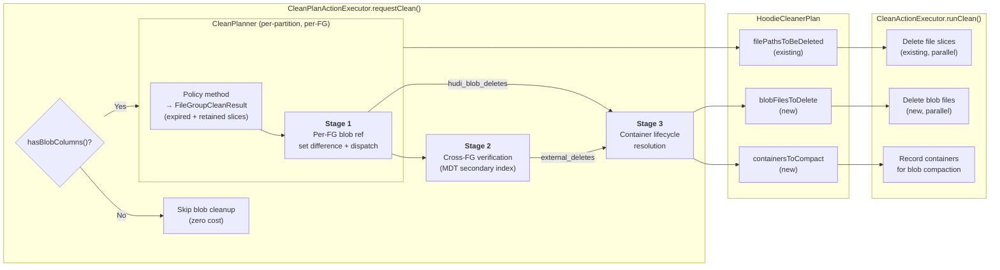
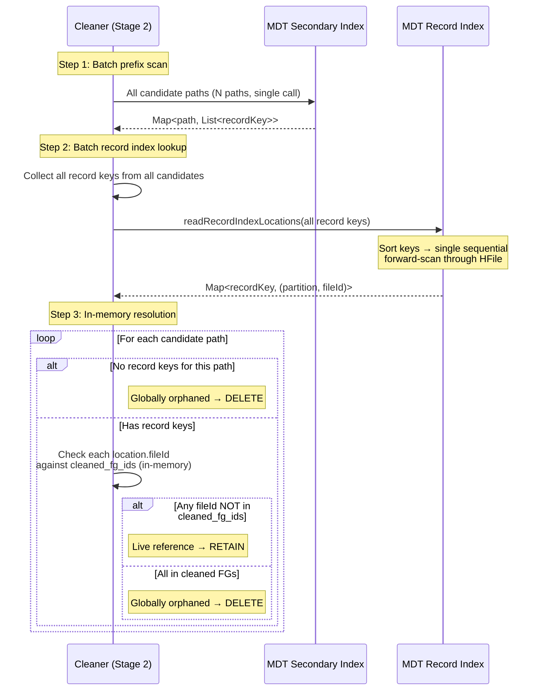
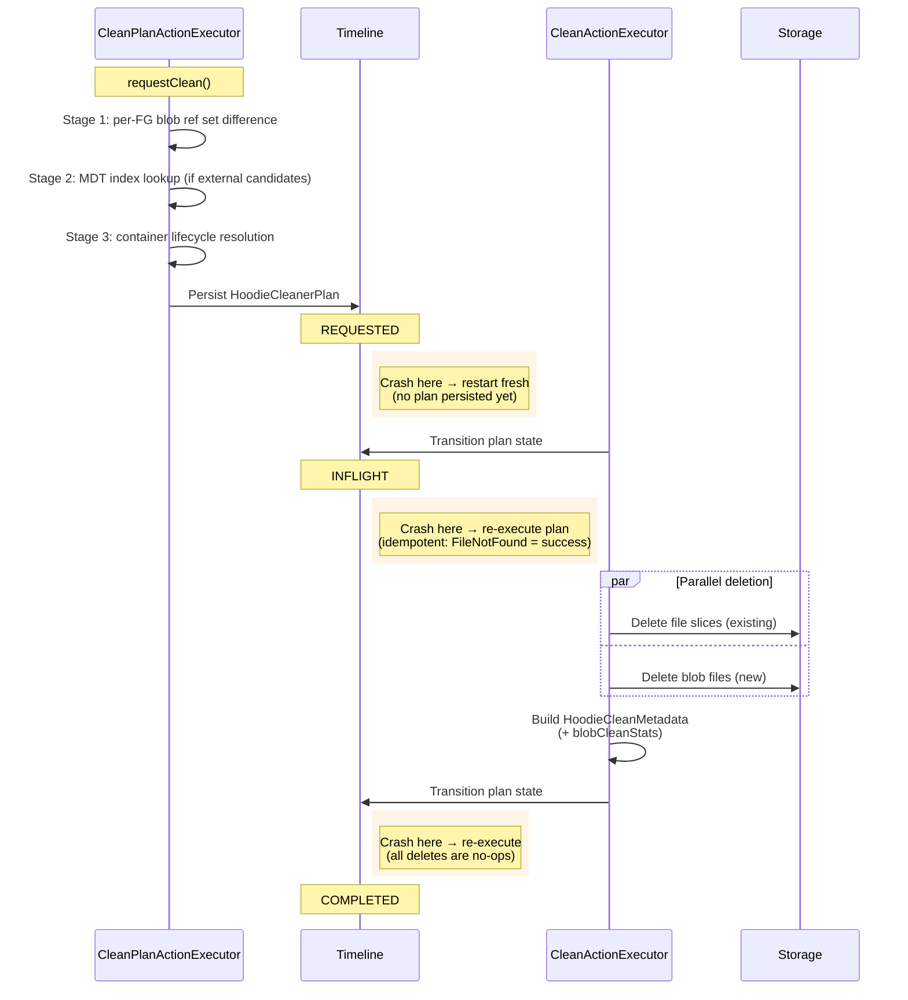
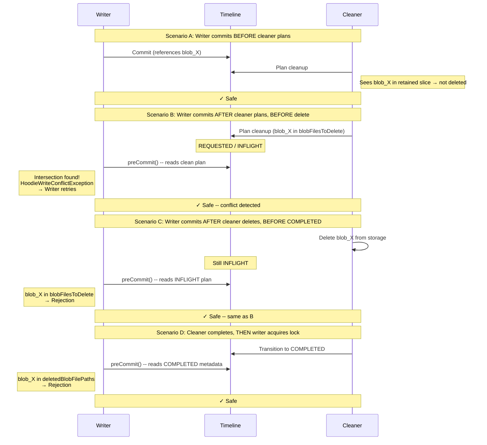

<!--
  Licensed to the Apache Software Foundation (ASF) under one or more
  contributor license agreements.  See the NOTICE file distributed with
  this work for additional information regarding copyright ownership.
  The ASF licenses this file to You under the Apache License, Version 2.0
  (the "License"); you may not use this file except in compliance with
  the License.  You may obtain a copy of the License at

       http://www.apache.org/licenses/LICENSE-2.0

  Unless required by applicable law or agreed to in writing, software
  distributed under the License is distributed on an "AS IS" BASIS,
  WITHOUT WARRANTIES OR CONDITIONS OF ANY KIND, either express or implied.
  See the License for the specific language governing permissions and
  limitations under the License.
-->

# RFC-100 Part 2: Blob Cleanup for Unstructured Data

## Proposers

- @voon

## Approvers

- (TBD)

## Status

Issue: <Link to GH feature issue>

> Please keep the status updated in `rfc/README.md`.

---

## Abstract

When Hudi cleans expired file slices, out-of-line blob files they reference may become orphaned --
still consuming storage but unreachable by any query. This RFC extends the existing file slice
cleaner to identify and delete these orphaned blob files safely and efficiently. The design uses a
three-stage pipeline: (1) per-file-group set-difference to find locally-orphaned blobs, (2) an MDT
secondary index lookup for cross-file-group verification of externally-referenced blobs, and (3)
container file lifecycle resolution. For Hudi-created blobs, cleanup is essentially free -- structural
path uniqueness eliminates cross-file-group concerns entirely. For user-provided external blobs,
targeted index lookups scale with the number of candidates, not the table size. Tables without blob
columns pay zero cost.

---

## Background

### Why Blob Cleanup Is Needed

RFC-100 introduces out-of-line blob storage for unstructured data (images, video, documents). A
record's `BlobReference` field points to an external blob file by `(path, offset, length)`. When
the cleaner expires old file slices, the blob files they reference may no longer be needed -- but the
existing cleaner has no concept of transitive references. It deletes file slices without considering
the blob files they point to. Without blob cleanup, orphaned blobs accumulate indefinitely.

### Two Blob Flows

Blob cleanup must support two distinct entry flows with fundamentally different properties:

**Flow 1 -- Hudi-created blobs.** Blobs created by Hudi's write path, stored at
`{table}/.hoodie/blobs/{partition}/{col}/{instant}/{blob_id}`. The commit instant in the path
guarantees uniqueness (C11), and blobs are scoped to a single file group (P3). Cross-file-group
sharing does not occur. This is the expected majority flow for Phase 3 workloads.

**Flow 2 -- User-provided external blobs.** Users have existing blob files in external storage
(e.g., `s3://media-bucket/videos/`). Records reference these blobs directly by path. Hudi manages
the *references*, not the *storage layout*. Cross-file-group sharing is common -- multiple records
across different file groups can point to the same blob. This is the expected primary flow for
Phase 1 workloads.

| Property                  | Flow 1 (Hudi-created)             | Flow 2 (External)                    |
|---------------------------|-----------------------------------|--------------------------------------|
| Path uniqueness           | Guaranteed (instant in path, C11) | Not guaranteed (user controls)       |
| Cross-FG sharing          | Does not occur (FG-scoped)        | Common (multiple records, same blob) |
| Writer/cleaner race       | Cannot occur (D2)                 | Can occur (D3)                       |
| Per-FG cleanup sufficient | Yes                               | No -- cross-FG verification needed   |

### Constraints and Requirements Reference

Full descriptions and failure modes in [Appendix B](rfc-100-blob-cleaner-problem.md).

| ID  | Constraint                                      | Flow 1 | Flow 2 | Remarks                      |
|-----|-------------------------------------------------|--------|--------|------------------------------|
| C1  | Blob immutability (append-once, read-many)      | Y      | Y      |                              |
| C2  | Delete-and-re-add same path                     | --     | Y      | Eliminated for Flow 1 by C11 |
| C3  | Cross-file-group blob sharing                   | --     | Y      | Common for external blobs    |
| C4  | Container files (`(offset, length)` ranges)     | Y      | Y      |                              |
| C5  | MOR log updates shadow base file blob refs      | Y      | Y      |                              |
| C6  | Existing cleaner is per-file-group scoped       | Y      | Y      |                              |
| C7  | OCC is per-file-group                           | Y      | Y      | No global contention allowed |
| C8  | Clustering moves blob refs between file groups  | Y      | Y      |                              |
| C9  | Savepoints freeze file slices and blob refs     | Y      | Y      |                              |
| C10 | Rollback can invalidate or resurrect references | Y      | Y      |                              |
| C11 | Blob paths include commit instant               | Y      | --     | Eliminates C2, C3, C13       |
| C12 | Archival removes commit metadata                | Y      | Y      |                              |
| C13 | Cross-FG verification needed at scale           | --     | Y      |                              |

| ID  | Requirement                                                      |
|-----|------------------------------------------------------------------|
| R1  | No premature deletion (hard invariant)                           |
| R2  | No permanent orphans (bounded cleanup)                           |
| R3  | Container awareness (range-level liveness)                       |
| R4  | MOR correctness (over-retention acceptable, under-retention not) |
| R5  | Concurrency safety (no global serialization)                     |
| R6  | Scale proportional to work, not table size                       |
| R7  | No cost for non-blob tables                                      |
| R8  | All cleaning policies supported                                  |
| R9  | Crash safety and idempotency                                     |
| R10 | Observability (metrics for deleted, retained, reclaimed)         |

---

## Design Overview

### Design Philosophy

Blob cleanup extends the existing `CleanPlanner` / `CleanActionExecutor` pipeline -- same timeline
instant, same plan-execute-complete lifecycle, same crash recovery and OCC integration. A
`hasBlobColumns()` check gates all blob logic so non-blob tables pay zero cost.

The two flows have different cost structures, and the design keeps them separate. Flow 1
(Hudi-created blobs) gets per-FG cleanup with no cross-FG overhead. Flow 2 (external blobs) gets
targeted cross-FG verification via MDT secondary index. Dispatch is a string prefix check on the
blob path.

### Three-Stage Pipeline

| Stage       | Scope                | Purpose                                                                          | When it runs                           |
|-------------|----------------------|----------------------------------------------------------------------------------|----------------------------------------|
| **Stage 1** | Per-file-group       | Collect expired/retained blob refs, compute set difference, dispatch by category | Always (for blob tables)               |
| **Stage 2** | Cross-file-group     | Verify external blob candidates against MDT secondary index or fallback scan     | Only when external candidates exist    |
| **Stage 3** | Container resolution | Determine delete vs. flag-for-compaction at the container level                  | Only when container blobs are involved |

### Independent Implementability

The three stages have clean input/output interfaces and can be implemented, tested, and shipped
independently:

| Stage   | Input                                                   | Output                                              |
|---------|---------------------------------------------------------|-----------------------------------------------------|
| Stage 1 | `FileGroupCleanResult` (expired + retained slices)      | `hudi_blob_deletes`, `external_candidates`          |
| Stage 2 | `external_candidates`, `cleaned_fg_ids`                 | `external_deletes`                                  |
| Stage 3 | `hudi_blob_deletes` + `external_deletes`, retained refs | `blob_files_to_delete`, `containers_for_compaction` |

A shared foundation layer must land first (see [Rollout / Adoption Plan](#rollout--adoption-plan)), after which stages
can proceed in any order.

### Key Decisions

| Decision            | Choice                                                  | Rationale                                                          |
|---------------------|---------------------------------------------------------|--------------------------------------------------------------------|
| Blob identity       | `(path, offset, length)` tuple                          | Handles containers (C4) and path reuse (C2) correctly              |
| Cleanup scope       | Per-FG (Hudi blobs) + MDT index lookup (external blobs) | Aligns with OCC (C7) and existing cleaner (C6); scales for C13     |
| Dispatch mechanism  | Path prefix check on blob path                          | Zero-cost classification; Hudi blobs match `.hoodie/blobs/` prefix |
| Cross-FG mechanism  | MDT secondary index on `reference.external_path`        | Short-circuits on first non-cleaned FG ref; first-class for Flow 2 |
| Write-path overhead | None (Flow 1); MDT index maintenance (Flow 2)           | Index maintained by existing MDT pipeline, not a new write cost    |
| MOR strategy        | Over-retain (union of base + log refs)                  | Safe (C5, R4); cleaned after compaction                            |
| Container strategy  | Tuple-level tracking; delete only when all ranges dead  | Correct (C4, R3); partial containers flagged for blob compaction   |



---

## Algorithm

### Stage 1: Per-File-Group Local Cleanup

Stage 1 runs after the existing policy logic determines which file slices are expired and retained
for a given file group. It collects blob refs from both sets and computes locally-orphaned blobs by
set difference.

```
Input:  A file group FG with expired_slices and retained_slices (from policy)
Output: hudi_blob_deletes     -- blobs safe to delete immediately
        external_candidates   -- external blobs needing cross-FG verification

for each file_group being cleaned:

    // Collect expired blob refs (base files + log files)
    // Must read log files: blob refs introduced and superseded within the log
    // chain before compaction would otherwise become permanent orphans.
    expired_refs = Set<(path, offset, length)>()
    for slice in expired_slices:
        for ref in extractBlobRefs(slice.baseFile):   // columnar projection
            if ref.type == OUT_OF_LINE and ref.managed == true:
                expired_refs.add((ref.path, ref.offset, ref.length))
        for ref in extractBlobRefs(slice.logFiles):   // full record read
            if ref.type == OUT_OF_LINE and ref.managed == true:
                expired_refs.add((ref.path, ref.offset, ref.length))

    if expired_refs is empty:
        continue                                       // no blob work for this FG

    // Collect retained blob refs (base files only)
    // Cleaning is fenced on compaction: retained base files contain the merged
    // state. Log reads are unnecessary -- any shadowed base ref causes safe
    // over-retention, cleaned after the next compaction cycle.
    retained_refs = Set<(path, offset, length)>()
    for slice in retained_slices:
        for ref in extractBlobRefs(slice.baseFile):   // columnar projection only
            if ref.type == OUT_OF_LINE and ref.managed == true:
                retained_refs.add((ref.path, ref.offset, ref.length))

    // Compute local orphans by set difference
    local_orphans = expired_refs - retained_refs

    // Dispatch by blob category
    for ref in local_orphans:
        if ref.path starts with TABLE_PATH + "/.hoodie/blobs/":
            hudi_blob_deletes.add(ref)             // P3: no cross-FG refs possible
        else:
            external_candidates.add(ref)           // C13: cross-FG refs are common
```

**Correctness notes:**

- **Hudi-created blobs:** If a blob ref appears in expired but not retained slices of the same FG,
  it is globally orphaned -- Hudi blobs are FG-scoped (C11), so no cross-FG check is needed.
- **MOR -- expired side reads base + logs:** Blob refs can be introduced and superseded entirely
  within the log chain (e.g., `log@t2: row1→blob_B`, then `log@t3: row1→blob_C`). After
  compaction, `blob_B` exists only in the expired log. Skipping logs would orphan it permanently.
- **MOR -- retained side reads base only:** Cleaning is fenced on compaction, so retained base
  files contain the merged state. Shadowed base refs cause over-retention (safe), cleaned after
  the next compaction.
- **Savepoints:** Inherited from existing cleaner -- savepointed slices stay in the retained set.
- **Replaced FGs (clustering):** `retained_slices` is empty, so all blob refs become candidates.
  Hudi blobs are safe to delete (clustering creates new blobs in the target FG). External blobs
  flow to Stage 2 (clustering copies the pointer, so Stage 2 finds it in the target FG).

### Stage 2: Cross-FG Verification (External Blobs)

Stage 2 executes only when `external_candidates` is non-empty. For Flow 1 workloads (Hudi-created
blobs only), this stage is skipped entirely.

#### Primary path: MDT secondary index

When the MDT secondary index on `reference.external_path` is available and fully built:

```
Input:  external_candidates, cleaned_fg_ids
Output: external_deletes (confirmed globally orphaned)

candidate_paths = external_candidates.map(ref -> ref.path).distinct()

// Step 1: Batched prefix scan on secondary index
// Key format: escaped(external_path)$escaped(record_key)
// Returns ALL record keys that reference each candidate path
path_to_record_keys = mdtMetadata.readSecondaryIndexDataTableRecordKeysWithKeys(
    HoodieListData.eager(candidate_paths), indexPartitionName)
    .groupBy(pair -> pair.getKey())

// Step 2: Batch record index lookup -- ONE call for ALL record keys
// Sorts keys internally, single sequential forward-scan through HFile.
all_record_keys = path_to_record_keys.values().flatMap()
all_locations = mdtMetadata.readRecordIndexLocations(
    HoodieListData.eager(all_record_keys))             // -> Map<recordKey, (partition, fileId)>

// Step 3: In-memory resolution with short-circuit per candidate
for path in candidate_paths:
    record_keys = path_to_record_keys.getOrDefault(path, [])

    if record_keys is empty:
        external_deletes.addAll(candidates for this path)  // globally orphaned
        continue

    found_live_reference = false
    for rk in record_keys:
        location = all_locations.get(rk)
        if location != null and location.fileId NOT in cleaned_fg_ids:
            found_live_reference = true
            break                                           // short-circuit (in-memory)

    if not found_live_reference:
        external_deletes.addAll(candidates for this path)   // all refs in cleaned FGs
```

**Cost model.** Three steps: (1) batched prefix scan on secondary index, (2) batched record index
lookup in a single sorted HFile scan, (3) in-memory resolution with short-circuit. Steps 1 and 2
are each a single I/O pass; step 3 is pure hash set lookups.

| Step                      | I/O                                           | Estimated cost (2K candidates) |
|---------------------------|-----------------------------------------------|--------------------------------|
| 1. Prefix scan (batched)  | 1 HFile open + forward scan of N prefix keys  | ~2-5s                          |
| 2. Record index (batched) | 1 HFile open + forward scan of 6K sorted keys | ~1-2s                          |
| 3. In-memory resolution   | Hash set checks (cleaned_fg_ids)              | ~0ms                           |

*Estimates assume cloud object storage (S3/GCS/ADLS), ~10-100ms per-read latency, ~50-200 MB/s
sequential throughput, 64-256KB HFile blocks. Step 1: a 250K-entry secondary index is ~50MB; a
sorted scan for 2K prefixes reads ~200-500 blocks, dominated by HFile open (~100-200ms) plus
sequential block reads with cold-cache latency overhead. Step 2: similar profile, fewer blocks
hit relative to index size. Pending benchmarking.*

**Index definition.** Uses the existing `HoodieIndexDefinition` mechanism with
`sourceFields = ["<blob_col>", "reference", "external_path"]`. The nested field path is supported
by `HoodieSchemaUtils.projectSchema()` and `SecondaryIndexRecordGenerationUtils`. No new index
infrastructure is needed.

**Safety check.** The cleaner verifies the index is fully built before using it via
`getMetadataPartitions()` and `getMetadataPartitionsInflight()`. A partially-built index falls
back to the table scan path.

#### Fallback path: table scan with circuit breaker

When the MDT secondary index is unavailable, Stage 2 falls back to a parallelized table scan
across all partitions. A circuit breaker (`hoodie.cleaner.blob.external.scan.max.candidates`,
default 1000) defers cleanup if candidates exceed the threshold, preventing the scan from becoming
a bottleneck on large tables. The operator is warned to enable the MDT secondary index.

#### Decision matrix

| Condition                   | Path used     | Cost                  | Suitable for                   |
|-----------------------------|---------------|-----------------------|--------------------------------|
| No external candidates      | Skip Stage 2  | Zero                  | Flow 1 workloads               |
| MDT secondary index enabled | Index lookup  | O(candidates)         | Flow 2 at any scale            |
| No index, few candidates    | Table scan    | O(candidates * table) | Small tables, few shared blobs |
| No index, many candidates   | Circuit break | Zero (deferred)       | Large tables -- index required |



### Stage 3: Container File Lifecycle

Container files pack multiple blobs at different `(offset, length)` ranges. A container can only be
deleted when *all* ranges within it are unreferenced.

```
all_deletes = hudi_blob_deletes + external_deletes

// Non-container blobs: each occupies an entire file -> delete directly
for ref in all_deletes where ref.offset is null:
    blob_files_to_delete.add(ref.path)

// Container blobs: group by path, check for remaining live ranges
for each container_path in container_range_deletes grouped by path:
    dead_ranges = ranges being deleted for this container
    live_ranges = retained refs (from Stage 1) + referenced refs (from Stage 2)

    if live_ranges is empty:
        blob_files_to_delete.add(container_path)           // entire container dead
    else:
        containers_for_compaction.add(container_path, dead_ranges)  // partial -> repack
```

For Hudi-created containers, all ranges belong to the same FG (instant in path scopes it to a
single write), so retained refs from Stage 1 are sufficient -- no cross-FG check needed.

### Execution Flow

```
1. CleanPlanActionExecutor.requestClean()
   ├── hasBlobColumns(table)?                         // R7: zero-cost gate
   ├── CleanPlanner: for each partition, for each file group:
   │     ├── Refactored policy method -> FileGroupCleanResult
   │     └── If hasBlobColumns: Stage 1 per FG
   ├── CleanPlanner: replaced file groups -> Stage 1
   ├── If external_candidates non-empty: Stage 2
   ├── Stage 3: container lifecycle resolution
   ├── Build HoodieCleanerPlan (+ blobFilesToDelete, containersToCompact)
   └── Persist plan to timeline (REQUESTED state)

2. CleanActionExecutor.runClean()
   ├── Transition to INFLIGHT
   ├── Delete file slices (existing, parallelized)
   ├── Delete blob files (new, same parallelized pattern)
   ├── Record containers for blob compaction (metadata only)
   ├── Build HoodieCleanMetadata with blobCleanStats
   └── Transition to COMPLETED
```



---

## Integration with Existing Cleaner

### CleanPlanner Refactoring

The existing `CleanPlanner` policy methods produce `CleanFileInfo` objects (file paths to delete)
without exposing the expired/retained slice partition that blob cleanup needs. We introduce a new
return type:

```java
public class FileGroupCleanResult {
  private final List<CleanFileInfo> filePathsToDelete;
  private final List<FileSlice> expiredSlices;
  private final List<FileSlice> retainedSlices;
}
```

The three policy methods (`getFilesToCleanKeepingLatestVersions`,
`getFilesToCleanKeepingLatestCommits`, `getFilesToCleanKeepingLatestHours`) are refactored to
collect both expired and retained slices alongside the existing `CleanFileInfo` production. The
existing behavior is unchanged -- the refactoring adds output without modifying the
expired/retained classification logic.

### Replaced File Group Handling

Replaced file groups (from clustering) are cleaned via `getReplacedFilesEligibleToClean()`. A
parallel method `getReplacedFileGroupBlobCleanResults()` produces `FileGroupCleanResult` objects
with `retainedSlices = empty` and `expiredSlices = all slices`. This feeds into Stage 1 identically
to normal file groups.

### Schema Changes: HoodieCleanerPlan

Two new nullable fields with null defaults (backward compatible):

- **`blobFilesToDelete`**: `List<HoodieCleanBlobFileInfo>` -- blob files where all ranges are dead.
  The executor deletes these.
- **`containersToCompact`**: `List<HoodieCleanContainerInfo>` -- containers with mixed live/dead
  ranges, including the dead `(offset, length)` ranges. Handed to the blob compaction service.

### Schema Changes: HoodieCleanMetadata

A new nullable field `blobCleanStats` of type `HoodieBlobCleanStats`:

- `totalBlobFilesDeleted`, `totalBlobFilesRetained`, `totalContainersFlaggedForCompaction`
- `totalBlobStorageReclaimed`
- `deletedBlobFilePaths`, `failedBlobFilePaths`

### hasBlobColumns() Gate

An in-memory schema check (`TableSchemaResolver.getTableSchema().containsBlobType()`) gates all
blob cleanup logic. Requires making `containsBlobType()` public (one-line visibility change).

---

## Concurrency & Safety

### Writer-Cleaner Race: Two-Sided Guard

**Hudi-created blobs (Flow 1): structurally impossible.** A new write creates new blob files with a
new instant in the path (C11). An UPSERT carries forward blob refs from retained slices (already
live). There is no mechanism for a writer to reference a Hudi-created blob that exists only in
expired slices. No writer-side check is needed for Flow 1.

**External blobs (Flow 2): writer-side conflict check in `preCommit()`.** The gap between the
cleaner's planning-time snapshot and its actual file deletion is closed by a commit-time conflict
check:

1. Writers track external managed blob paths in `HoodieWriteStat.externalBlobPaths` (in-memory
   collection, no additional I/O).
2. At commit time (in `preCommit()`, under the existing transaction lock), the writer checks all
   three clean states -- COMPLETED, INFLIGHT, and REQUESTED -- because a REQUESTED plan can begin
   executing at any moment (the REQUESTED→INFLIGHT transition doesn't acquire the transaction
   lock). It checks `deletedBlobFilePaths` (COMPLETED) and `blobFilesToDelete` (INFLIGHT/REQUESTED).
3. If any overlap is found, the commit is rejected with `HoodieWriteConflictException` and the
   writer retries.

Cost is zero for non-blob tables and Flow 1. For Flow 2: one timeline scan + 1-3 metadata reads.



### Concurrency Matrix

| Operation                      | Concurrent with Blob Cleaner | Safety Mechanism                                          |
|--------------------------------|------------------------------|-----------------------------------------------------------|
| Regular write (INSERT/UPSERT)  | Safe                         | C11 path uniqueness (Flow 1); writer-side check (Flow 2)  |
| Compaction                     | Safe                         | `isFileSliceNeededForPendingMajorOrMinorCompaction`       |
| Clustering                     | Safe                         | Replaced FG lifecycle; Stage 2 for external blobs         |
| Rollback                       | Safe                         | MOR over-retention; clean operates on post-rollback state |
| Savepoint create/delete        | Safe                         | `isFileSliceExistInSavepointedFiles`                      |
| Archival                       | No interaction               | Blob cleaner reads file slices, not commit metadata       |
| Another cleaner instance       | Safe                         | `TransactionManager`; `checkIfOtherWriterCommitted`       |
| Blob compaction                | Safe                         | Independent lifecycle                                     |
| MDT writes (index maintenance) | Safe                         | MDT commit atomicity                                      |

### Crash Recovery

Crash recovery is idempotent by construction, using the same mechanisms as existing file slice
cleaning:

| Crash point                             | Recovery                                                                                               |
|-----------------------------------------|--------------------------------------------------------------------------------------------------------|
| During planning (before plan persisted) | No REQUESTED instant on timeline. Cleaner starts fresh.                                                |
| After plan persisted, before execution  | REQUESTED instant found; plan re-read and executed.                                                    |
| During execution (partial deletes)      | INFLIGHT instant re-executed. Already-deleted files return FileNotFoundException → treated as success. |
| After execution, before COMPLETED       | INFLIGHT re-executed. All deletes are no-ops. Metadata written, instant transitions to COMPLETED.      |

---

## Performance

### Cost Summary

| Workload                 | Stage 1 cost                    | Stage 2 cost               | Total per cleanup cycle        |
|--------------------------|---------------------------------|----------------------------|--------------------------------|
| Non-blob table           | Zero (`hasBlobColumns` gate)    | N/A                        | **Zero**                       |
| Flow 1 (Hudi-created)    | ~6 Parquet reads per cleaned FG | Skipped                    | O(cleaned_FGs * slices_per_FG) |
| Flow 2 (external, index) | ~6 Parquet reads per cleaned FG | O(C * R_avg)               | O(cleaned_FGs + C * R_avg)     |
| Flow 2 (external, scan)  | ~6 Parquet reads per cleaned FG | O(candidates * table_size) | Circuit breaker limits this    |

### Back-of-Envelope: Example 7 (50K FGs, 2K External Candidates)

| Parameter                           | Value     | Notes                                                |
|-------------------------------------|-----------|------------------------------------------------------|
| FGs cleaned this cycle              | 500       | 1% of table                                          |
| Stage 1: reads per FG               | ~6        | 3 retained + 3 expired slices                        |
| Stage 1: total reads                | 3,000     | Parallelized across executors, ~20s                  |
| External blob candidates            | 2,000     | Locally orphaned in cleaned FGs                      |
| Avg refs per candidate              | 3         | Random assumption                                    |
| Total record keys                   | 6,000     | 2,000 * 3                                            |
| **Stage 2 cost (estimated)**        |           |                                                      |
| Step 1: batched prefix scan         | 1 call    | Returns 6K record keys, ~2-5s estimated              |
| Step 2: batched record index lookup | 1 call    | 6K keys sorted, single HFile scan, ~1-2s estimated   |
| Step 3: in-memory resolution        | 6K checks | Hash set lookups against cleaned_fg_ids, ~0ms        |
| **Total Stage 2**                   | **~3-7s** | Estimated; see I/O assumptions in Stage 2 cost model |
| Comparison: naive full-table scan   | 12.5TB    | 50K FGs * 5 slices * 50MB = prohibitive              |

### Memory Budget

Per-FG blob ref sets: ~100MB peak (500K records * 100 bytes/ref for expired + retained). FGs are
processed sequentially within each partition batch -- per-FG sets are computed and discarded, not
accumulated. Only the output lists (`hudi_blob_deletes`, `external_candidates`) grow, containing
only orphaned refs (much smaller). Peak heap: ~100MB * `cleanerParallelism` = 400MB-1.6GB.

---

## Configuration

| Property                                           | Default | Description                                                                       |
|----------------------------------------------------|---------|-----------------------------------------------------------------------------------|
| `hoodie.cleaner.blob.enabled`                      | `true`  | Enable blob cleanup during clean action                                           |
| `hoodie.cleaner.blob.dry.run`                      | `false` | Compute blob cleanup plan and log results but do not execute                      |
| `hoodie.cleaner.blob.external.scan.parallelism`    | `10`    | Parallelism for Stage 2 fallback table scan                                       |
| `hoodie.cleaner.blob.external.scan.max.candidates` | `1000`  | Circuit breaker for Stage 2 fallback scan; exceeding defers external blob cleanup |
| `hoodie.metadata.index.secondary.column`           | (none)  | Set to `<blob_col>.reference.external_path` for Flow 2 cross-FG verification      |

---

## Rollout / Adoption Plan

Each stage can be implemented, tested, and shipped independently once the foundation layer is in
place (see [Independent Implementability](#independent-implementability)).

**Foundation (shared prerequisite).** `CleanPlanner` refactoring (policy methods return
`FileGroupCleanResult`), `BlobRef` type, schema changes (nullable `blobFilesToDelete` and
`containersToCompact` fields), and the `hasBlobColumns` zero-cost gate.

**Stage 1 (per-FG cleanup).** Set-difference logic and dispatch by blob category. Produces
`hudi_blob_deletes` (immediate) and `external_candidates` (for Stage 2).

**Stage 2 (cross-FG verification) -- priority.** Flow 2 (external blobs) is the primary initial
use case -- cross-FG verification prevents premature deletion of shared blobs. Requires MDT +
record index + secondary index on `reference.external_path` (P6). Includes fallback table scan
with circuit breaker.

**Stage 3 (container lifecycle).** Delete-entire-file vs. flag-for-compaction at the container
level. Needed only when container files are used.

**Writer-side conflict check.** `preCommit()` conflict check for Flow 2 concurrency safety.
Closes the writer-cleaner race window. Independent of the three stages.

### Backward Compatibility

- All schema changes use nullable fields with null defaults. Existing clean plans and metadata
  are unaffected.
- `hasBlobColumns()` gate ensures zero behavioral change for non-blob tables.
- One prerequisite code change: `HoodieSchema.containsBlobType()` visibility from package-private
  to public (one-line change, no behavioral impact).

---

## Test Plan

### Unit Tests

- **Stage 1 set-difference:** Verify correct orphan identification for COW and MOR file groups,
  including MOR over-retention (shadowed base refs kept until post-compaction).
- **Stage 1 dispatch:** Verify Hudi-created blobs route to `hudi_blob_deletes` and external blobs
  route to `external_candidates`.
- **Stage 2 index lookup:** Verify short-circuit behavior (stop after first live reference), empty
  results (globally orphaned), and batched prefix scans.
- **Stage 2 fallback:** Verify table scan correctness and circuit breaker activation.
- **Stage 3 container lifecycle:** Verify delete-all-dead vs. flag-for-compaction decisions.
- **Writer-side conflict check:** Verify detection of conflicts with COMPLETED, INFLIGHT, and
  REQUESTED clean actions.

### Integration Tests

- End-to-end clean cycle with Hudi-created blob table (COW and MOR).
- End-to-end clean cycle with external blob table and MDT secondary index.
- Clean cycle with replaced file groups (post-clustering).

### Concurrency Tests

- Writer-cleaner race scenarios A-D (from concurrency analysis) with external blobs.
- Concurrent clean + compaction with blob tables.

### Backward Compatibility

- Non-blob table clean cycle produces identical behavior (no `blobFilesToDelete`, no
  `blobCleanStats`).
- Clean plan deserialization with and without blob fields (nullable field compatibility).

---

## Appendix

- **[Problem Statement, Constraints & Requirements](rfc-100-blob-cleaner-problem.md)**
  -- Complete problem scope, all 13 constraints (C1-C13), all 10 requirements (R1-R10), 8
  illustrative failure mode examples, and open questions.

### Why the MDT Secondary Index Maps to Record Keys (Not File Groups)

Stage 2 uses a two-hop lookup: secondary index → record keys → record index → file group locations.
This is not an artifact of this RFC — it is the fundamental design of Hudi's secondary index
([RFC-77](../rfc-77/rfc-77.md)). The rationale:

1. **Secondary keys are non-unique.** Unlike the record index (which maps unique record keys),
   a secondary index is on arbitrary user columns (e.g., `city`, `status`) where many records
   share the same value. The composite key format `{secondaryKey}${recordKey}` flattens this
   non-unique mapping into unique tuples that fit the existing spillable/merge map infrastructure.

2. **Record locations change independently of secondary key values.** Compaction, clustering,
   and updates move records between file groups. The record index already maintains this mapping
   correctly. A denormalized `secondary_key → file_group` mapping would duplicate that
   maintenance burden and risk staleness.

3. **Update handling requires tombstones on old values.** When a record's secondary key changes,
   the old value may reside in a different file group in the SI partition than the new value.
   The normalized design handles this with `old-secondary-key → (record-key, deleted)` tombstones,
   which is simpler than tracking file group transitions directly.

4. **Alternatives were evaluated and rejected.** RFC-77 considered direct `secondary_key →
   file_group` mapping, Guava MultiMap, Chronicle Map, and separate spillable structures — all
   rejected due to complexity, external dependencies, or maintenance cost.

For this RFC, the two-hop cost is negligible: Step 1 (prefix scan) and Step 2 (record index lookup)
are each a single batched HFile forward-scan, adding ~3-7s total for 2K candidates.
