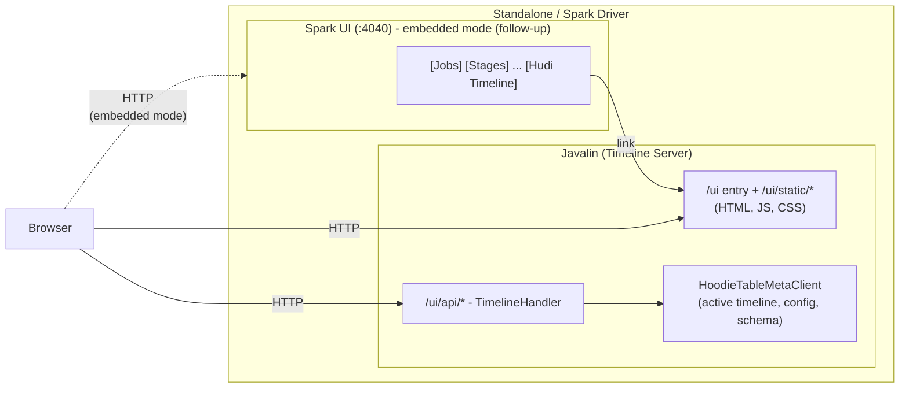
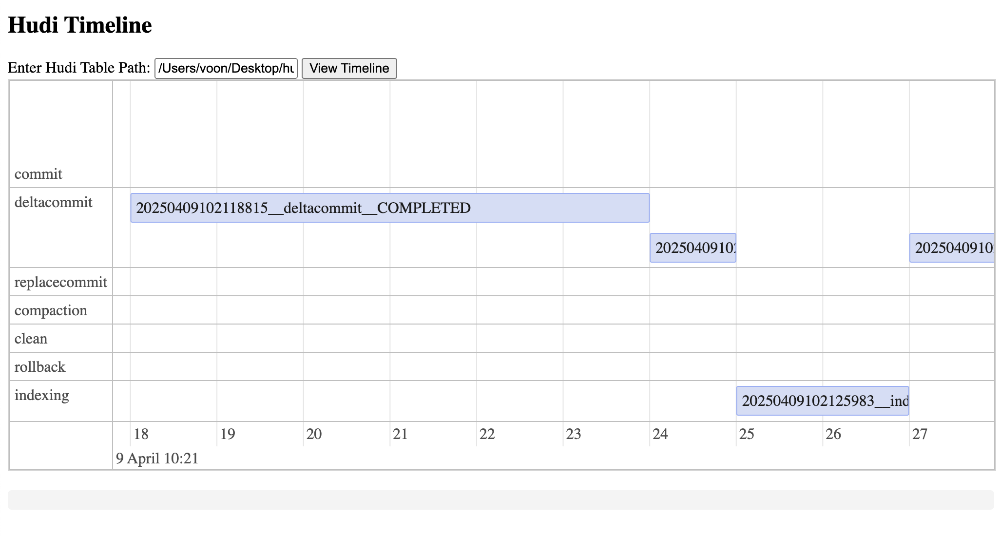

<!--
  Licensed to the Apache Software Foundation (ASF) under one or more
  contributor license agreements.  See the NOTICE file distributed with
  this work for additional information regarding copyright ownership.
  The ASF licenses this file to You under the Apache License, Version 2.0
  (the "License"); you may not use this file except in compliance with
  the License.  You may obtain a copy of the License at

       http://www.apache.org/licenses/LICENSE-2.0

  Unless required by applicable law or agreed to in writing, software
  distributed under the License is distributed on an "AS IS" BASIS,
  WITHOUT WARRANTIES OR CONDITIONS OF ANY KIND, either express or implied.
  See the License for the specific language governing permissions and
  limitations under the License.
-->

# RFC-94: Hudi Timeline User Interface (UI)

## Proposers

- @voonhous

## Approvers

- @danny0405
- @rahil-c
- @yihua

## Status

JIRA: [HUDI-9315](https://issues.apache.org/jira/browse/HUDI-9315)

## Abstract

Hudi Timeline metadata is stored as timestamped files representing state transitions of actions like `commit`,
`deltacommit` and `compaction`. These files are accessible via the CLI or a file explorer, but it's hard to visualize
concurrent actions, spot missing transitions, or tell how long each step took. Debugging timeline issues by reading
filenames is tedious.

This RFC proposes a UI-based timeline visualization tool that parses these metadata files, groups related actions, and
renders them in a time-ordered, interactive view. Users can track the lifecycle of each operation, see concurrency
patterns, and spot anomalies or long-running tasks. The implementation extends `hudi-timeline-service` with a new
`/ui/` surface - entry page, static assets and REST API - built on a static HTML + JavaScript frontend powered by
[vis-timeline](https://github.com/visjs/vis-timeline), served via Javalin's built-in static file serving with zero new
Java compile-time dependencies.

## Background

Today, we rely on the CLI or direct filesystem inspection to understand timeline state through metadata files. These
files represent different actions (e.g., `deltacommit`, `compaction`) and their lifecycle states (`requested`,
`inflight`, `completed`), encoded in file names like:

```shell
20250409102118815.deltacommit.inflight
20250409102118815.deltacommit.requested
20250409102118815_20250409102124339.deltacommit
20250409102121593.compaction.inflight
20250409102121593.compaction.requested
20250409102121593_20250409102122232.commit
20250409102124581.deltacommit.inflight
20250409102124581.deltacommit.requested
20250409102124581_20250409102125667.deltacommit
20250409102124612.compaction.inflight
20250409102124612.compaction.requested
20250409102124612_20250409102124892.commit
20250409102127348.deltacommit.inflight
20250409102127348.deltacommit.requested
20250409102127348_20250409102128481.deltacommit
20250409102127500.compaction.inflight
20250409102127500.compaction.requested
20250409102127500_20250409102127721.commit
```

This works, but has a few problems:

1. No visibility into concurrency
    - Multiple actions (e.g., `deltacommit` and `compaction`) often run concurrently.
    - The CLI doesn't help correlate or visualize overlapping operations.
2. Lack of temporal context
    - Timestamps are embedded in filenames but are hard to compare visually - year, month and day can be quickly
      determined, but minutes and seconds are harder to parse.
    - No easy way to tell how long an action took or whether it's stalling unless you manually calculate the difference
      between requested and completion time.
3. Hard to spot inconsistencies or missing states
    - An `inflight` compaction without a corresponding `commit` can indicate a starved/stuck compaction, which usually
      blocks archiving/cleaning.
    - These gaps are easy to miss when scanning filenames.

On top of that, all timeline files are now stored as Avro binaries. Inspecting their contents requires custom Avro
readers to convert the binaries to JSON.

## Scope

This RFC covers visualization of metadata available in Hudi tables. All features are **READ-ONLY** - there is no support
for starting or spawning jobs that mutate a Hudi table.

Alongside the timeline, the UI surfaces two additional read-only metadata views: the table's configuration
(`hoodie.properties`) and its schema-change history.

The following are **out of scope**:

- **Archived timeline:** Only the active timeline is rendered. Loading instants from LSM-based archive files is left for
  future work.
- **Metadata table overlay:** The metadata table's own timeline is not shown alongside the main table timeline.
- **Write/mutation operations:** The UI cannot trigger compactions, clustering, or any write action.
- **Authentication/authorization:** No access control is added. The timeline server is assumed to run in a trusted
  network, same as today.

  **Threat model:** None of the four UI views is `/v1`-parity. The existing `/v1/` routes serve only
  file-slice/base-file DTOs plus filename-level instant DTOs (action, requested/completion time, state); every UI
  view widens the read surface beyond that:

    - **Timeline** (`/ui/api/timeline/instants/all`) is a superset of `/v1`'s `timeline/instants/all`. The
      `/v1` route is served from the `FileSystemView`'s write timeline, which is restricted to completed instants plus
      pending (log)compaction, and to write actions only. The UI route reads the full active timeline, so it
      additionally exposes `clean`, `rollback`, `savepoint`, `restore` and `indexing` instants, and every
      requested/inflight state.
    - **Instant detail** (`/ui/api/timeline/instant`) has no `/v1` counterpart at all - no existing route
      returns instant *content*. It returns deserialized instant metadata, e.g. a `HoodieCommitMetadata` carrying
      per-partition write stats (file paths, record counts) and the table schema under the `schema` key of
      `extraMetadata`. Its `instant` param is attacker-controlled and lands in a storage path, so the route resolves
      the requested instant against the active timeline rather than reconstructing it from the params; see
      [Handler Design](#handler-design). Without that, it is an arbitrary-path read, not a timeline read.
    - **Table config** (`/ui/api/table/config`) returns the full `hoodie.properties` via
      `HoodieTableConfig.getProps()`.
    - **Schema history** (`/ui/api/table/schema/history`) exposes current and historical table schemas - the
      same schema content the instant-detail view can surface via `extraMetadata`.

  All of it is read-only and already readable by anyone with filesystem access to `.hoodie/`; the UI adds no write or
  mutation capability, and opens no new network interface (the server binds to all interfaces on the
  driver/standalone host, as it does today). The most sensitive of the four is table config: properties can reference
  KMS endpoints, lock-provider connection strings or external key/vault paths, though they rarely embed secrets
  directly. The first cut serves table config unfiltered (sorted, as-is); a redacting/allowlisted config view is a
  possible future refinement for less-trusted interfaces. The primary control is that all UI routes are gated behind
  `--enable-ui` (off by default), with the server assumed to run on a trusted network. Operators on untrusted networks
  should front the server with a reverse proxy or restrict it to a private interface / localhost via network policy.

## Implementation

Keeping the implementation lightweight is a priority - we should add as few dependencies as possible. Changes go into
the existing `hudi-timeline-service` module, which contains a Javalin web-application that caches filesystem metadata of
a Hudi table for job executors during tagging/writing.

The first cut runs the UI on the Timeline Server in **STANDALONE** mode (see [Configuration](#configuration)) and is
self-contained within `hudi-timeline-service`. Enabling the UI on the **EMBEDDED** timeline server inside a Spark
driver, together with a Spark UI tab, requires cross-module wiring (`hudi-client-common`, `hudi-spark-client`); it is
designed below but deferred to a follow-up to keep the initial PR small and focused. The standalone UI lands first; the
embedded/Spark linking lands next.

The Hudi Timeline UI has two parts: the frontend and backend.

### Architecture

The timeline server can run standalone or embedded inside a Spark driver. In embedded mode, a tab in the Spark UI links
directly to the Hudi Timeline UI. The embedded mode and Spark UI tab (right side of the diagram below) are a planned
follow-up; the first cut is standalone-only.



There are two categories of requests:

1. **Static file requests** - Javalin serves JavaScript, CSS, and library assets from the classpath
   (`src/main/resources/public/`) under the `/ui/static/` URL prefix; `UiHandler` serves `index.html` at `/ui`. No
   server-side rendering or template engine is needed.
2. **REST API requests** (`/ui/api/*`) - `TimelineHandler` processes these requests, reading from a short-lived
   `HoodieTableMetaClient` built for the request's basepath - its `getActiveTimeline()` for the timeline routes, and
   table config/schema for the config/schema routes - and returning JSON.

### Frontend

The frontend is static HTML pages with vanilla JavaScript, similar to the Spark Web UI. Javalin's built-in static file
serving handles files from the classpath - no template engine (e.g., Thymeleaf) is needed and no new Java compile-time
dependencies are added.

No frontend build pipeline (npm, webpack, vite) is needed. Contributing to the UI requires only a text editor. Three
libraries are vendored as static assets: vis-timeline (timeline rendering), Bootstrap 5 (layout/styling), and renderjson
(collapsible JSON in the detail panel).

#### File Structure

```
hudi-timeline-service/src/main/resources/public/
├── index.html                     # Landing page with basepath input form
├── js/
│   └── timeline.js                # vis-timeline initialization and REST API calls
├── css/
│   └── style.css                  # Basic styling
└── lib/                           # Vendored third-party assets (see Dependency Impact)
    ├── vis-timeline/              # Timeline rendering (Apache-2.0 OR MIT)
    │   ├── vis-timeline-graph2d.min.js
    │   └── vis-timeline-graph2d.min.css
    ├── bootstrap/                 # Layout/styling (MIT)
    │   ├── bootstrap.bundle.min.js
    │   └── bootstrap.min.css
    └── renderjson/                # Collapsible JSON detail panel (ISC)
        └── renderjson.js
```

#### JavaScript Delivery: Bundled, No External Calls

All three libraries are served from bundled copies under `/ui/static/lib/` (`/ui/static/lib/vis-timeline/`,
`/ui/static/lib/bootstrap/`, `/ui/static/lib/renderjson/`). The UI makes no external network calls, so it works out of
the box in air-gapped and security-conscious deployments with no extra configuration. The bundled, minified assets add
~890KB to the JAR (vis-timeline ~575KB, Bootstrap 5 ~305KB, renderjson ~11KB).

Pinning a vendored copy (rather than loading from a CDN) keeps the UI deterministic and avoids a runtime dependency on
an external host being reachable. If automatic patch updates are wanted later, a CDN source can be added as an opt-in
config flag without changing this default.

#### vis-timeline Configuration

The timeline is configured with groups and items that map to Hudi's timeline model:

- **Groups:** One row per *comparable* action - `commit`, `deltacommit`, `replacecommit`, `clean`, `rollback`,
  `savepoint`, `restore`, `indexing`. Pending compaction, log-compaction and clustering are folded into the action they
  complete as, exactly as Hudi itself already does:

  | Pending action | Completes as     |
  |----------------|------------------|
  | `compaction`   | `commit`         |
  | `logcompaction`| `deltacommit`    |
  | `clustering`   | `replacecommit`  |

  This is not a UI invention - Hudi's active timeline has already applied this mapping before the UI sees an instant, so
  a completed compaction *arrives* as a `commit`. Giving compaction, log-compaction and clustering their own rows would
  produce rows that can never hold a completed instant. See [A1](#a1-why-a-completed-compaction-arrives-as-a-commit).
- **Items:** Completed instants are rendered as range bars spanning from `requestedTime` to `completionTime`.
  Non-completed instants (requested or inflight) are rendered as point items at `requestedTime`.

  Items keep their *raw* action for labelling and colouring, so folding rows together does not erase the distinction: a
  pending compaction is still labelled `compaction` while sitting in the `commit` row. This is what the stuck-compaction
  diagnosis in [Background](#background) needs - an inflight `compaction` point item with no following range bar in that
  row is a compaction that never committed. A *completed* compaction renders as an ordinary `commit` range bar, which is
  correct: on disk and to every other Hudi component, it is a commit. Clicking it shows `operationType: COMPACT` in the
  detail panel for anyone who needs to confirm the originating operation.
- **Color coding:** Items are colored by state:
    - Green -> `COMPLETED`
    - Yellow -> `INFLIGHT`
    - Red -> `REQUESTED`
- **Tooltip:** On hover, shows the action type, requested time, completion time, and duration.
- **Click handler:** Clicking an instant fetches its detail via `/ui/api/timeline/instant` and shows the
  deserialized JSON in a detail panel below the timeline.

### Backend

A `hudi-timeline-service` instance already serves filesystem metadata for multiple table basePaths since the
`FileSystemView`s are cached in a map keyed by basepath.

We extend this module with `/ui/api/` routes that serve the UI's timeline, config and schema metadata, reading each table
through a short-lived `HoodieTableMetaClient` built per request (see [Handler Design](#handler-design)).

#### API Specification

| Method | Path                                    | Parameters                                                            | Response        | Description                                                                                  |
|--------|-----------------------------------------|-----------------------------------------------------------------------|-----------------|----------------------------------------------------------------------------------------------|
| GET    | `/ui/api/timeline/instants/all` | `basepath` (required)                                                 | `UiTimelineDTO` | All active instants (each with requested time, completion time, action, state), wrapped in a timeline DTO |
| GET    | `/ui/api/timeline/instant`      | `basepath`, `instant`, `instantaction`, `instantstate` (all required) | JSON string     | Deserialized content of a specific instant's metadata (Avro -> JSON). The triple must match an instant in the active timeline, else 404 - see [Handler Design](#handler-design) |
| GET    | `/ui/api/table/config`          | `basepath` (required)                                                 | JSON object     | The table's `hoodie.properties` (sorted)                                                     |
| GET    | `/ui/api/table/schema/history`  | `basepath` (required), `limit` (optional, default 200, max 1000)      | JSON object     | Current schema; schema-change history over the last `limit` commits, oldest entry typed `baseline` rather than `change`; the scanned `window` (with a `truncated` flag); and `.schema` internal-schema history when present |

Static assets (JS, CSS, library files) are served from the classpath directory `src/main/resources/public/`, mounted
under the `/ui/static/` URL prefix via Javalin's static-files `hostedPath` (e.g., `/ui/static/js/timeline.js`,
`/ui/static/lib/...`). `UiHandler` additionally registers `GET /ui`, which returns `index.html` (with asset links
pointing at `/ui/static/...`) to give the UI a stable entry URL.

**Why `/ui/api/` and not `/v2/hoodie/view/`.** `/v1/hoodie/view` is not a public REST API - it is the RPC namespace of
`RemoteHoodieTableFileSystemView`, the wire protocol the file-system-view client speaks to this server. Mounting the UI
at `/v2/hoodie/view/` would therefore read as *version 2 of the FSV protocol*, which it is not, and would consume the
URL space a genuine FSV v2 will one day want. The UI is a different API for a different consumer (a browser, with
UI-shaped DTOs), so it gets its own namespace rather than a version bump of someone else's.

Putting the routes under `/ui` alongside the page and the assets also makes the whole feature **one prefix**: everything
under `/ui` is the UI, and `--enable-ui` gates exactly that subtree. The alternative left the flag gating three
unrelated prefixes (`/ui`, `/ui/static/*`, `/v2/hoodie/view/*`) for one feature.

**On response size and pagination:** `GET /ui/api/timeline/instants/all` returns the full active timeline. The
active timeline is bounded by archiving (the unbounded archived timeline is out of scope), so instant counts are
typically modest. The first cut intentionally returns all active instants and relies on client-side zoom/scroll and
filtering for navigation. If active-timeline sizes become a concern, the endpoint can be extended additively with
optional `from`/`to` time-range query params (and/or a `limit`) without breaking the existing contract.

#### DTO Design

The UI's timeline endpoint returns a `UiTimelineDTO` built from two UI DTOs in a `dto.ui` package, leaving the existing
`/v1/` FSV protocol contract untouched.

The v1 `InstantDTO` already carries everything needed to render range bars - `fromInstant` populates both
`requestedTime` and `completionTime` from `HoodieInstant` (added under HUDI-9332) - so the UI could consume the v1
timeline DTO directly. The UI DTOs are not about exposing new fields; they are a deliberate, low-cost choice to give the
UI API a cleaner JSON contract:

- **`UiInstantDTO`** (`o.a.h.common.table.timeline.dto.ui`) - the same source fields as v1, with UI-oriented JSON keys:
    - `action` - the instant's raw action (e.g., `commit`, `deltacommit`, `compaction`). Used to label and colour the
      item, and to address the instant on the `/ui/api/timeline/instant` route.
    - `comparableAction` - the action the instant completes (or would complete) as; the vis-timeline *group* key. Equal
      to `action` for everything except pending `compaction`/`logcompaction`/`clustering`. Computed server-side from
      Hudi's own mapping, so the table is not duplicated in JavaScript. See
      [A2](#a2-where-the-comparable-action-mapping-comes-from).
    - `requestedTime` (JSON `requestTs`) - requested timestamp (`HoodieInstant.requestedTime()`)
    - `completionTime` (JSON `completionTs`) - completion timestamp (`HoodieInstant.getCompletionTime()`), null for
      non-completed instants
    - `state` - the instant state (`REQUESTED`, `INFLIGHT`, `COMPLETED`)

  Versus v1, this adds `comparableAction`, renames `requestedTime`/`completionTime` to `requestTs`/`completionTs`, and
  drops v1's redundant legacy `ts` field (a duplicate of the requested time that the UI does not need).
- **`UiTimelineDTO`** - wraps a `List<UiInstantDTO>` (`instants`); this is what `/ui/api/timeline/instants/all`
  returns.

  Both carry a `Ui` prefix rather than a `V2` suffix. They are not version 2 of anything - they are the UI's DTOs, and
  naming them `V2` would imply a successor to the FSV protocol's `InstantDTO`, which they are not. The prefix also
  avoids a simple-name clash with the existing `dto.InstantDTO` that `TimelineHandler` still imports for the v1 routes.

#### Handler Design

The v2 endpoints are served by the existing `TimelineHandler` (which already serves the v1 timeline routes); a separate
`UiHandler` serves only the UI entry page.

`TimelineHandler` methods:

1. `getUiTimeline(basePath)` - maps `getActiveTimeline()` from the request's `HoodieTableMetaClient` to a
   `UiTimelineDTO`. The active timeline carries every `VALID_ACTIONS_IN_TIMELINE` action in all states
   (requested/inflight/completed), which the vis-timeline groups and requested/inflight point items require. The
   `FileSystemView` timeline (`getFileSystemView(basePath).getTimeline()`) cannot be used here: it is the write timeline
   filtered to completed plus (log)compaction instants, so it drops `clean`/`rollback`/`savepoint`/`restore`/`indexing`
   and every requested/inflight state.

   `getUiTimeline` populates `comparableAction` from the same mapping Hudi's own timeline filter used, and leaves
   `action` as-is (see [A1](#a1-why-a-completed-compaction-arrives-as-a-commit)).
2. `getInstantDetails(basePath, instant, action, state)` - reads the instant's content and deserializes it to JSON. A
   malformed `state`/`action` returns 400; an instant not present in the timeline returns 404; a read failure returns 500.

   **The requested instant is resolved against the loaded active timeline, never reconstructed from the request
   params.** The `instant` param is attacker-controlled and would otherwise land in a storage path, making this route an
   arbitrary-path read rather than a timeline read. The handler already holds the active timeline, so it looks the
   `(instant, action, state)` triple up among the timeline's instants and reads *that* `HoodieInstant`. The route can
   therefore only ever read instants the timeline itself lists. See
   [A3](#a3-why-the-instant-route-must-resolve-not-reconstruct).
3. `getTableConfig(basePath)` - returns the table's `hoodie.properties` as a sorted JSON object.
4. `getSchemaHistory(basePath, limit)` - reconstructs schema evolution from two sources; see
   [Schema-History Reconstruction](#schema-history-reconstruction) below.

**Stream ownership.** Hudi's non-deprecated instant reader hands back a raw open stream that the caller owns. Every
timeline content read in this RFC - the instant-detail route and the up-to-`limit` per-instant reads in schema-history -
goes through a single shared helper that closes under try-with-resources, releasing the handle on the failure path and
not only on success. Schema-history is the one that matters: at up to 1000 reads per request, with a Refresh control
re-issuing the fetch, a leaked handle exhausts file descriptors quickly.

**Per-request metaClient.** All four methods build a short-lived `HoodieTableMetaClient` for the request's basepath,
read from it, and discard it; no metaClient is shared across Javalin's request threads. At human-click frequency the
construction cost is negligible, a fresh instance is always current, and each request's reads stay self-consistent. A
long-lived per-basepath cache is deliberately avoided - it would save little (the data must be re-read every request
anyway) while introducing a reload-then-read race on a mutable object shared across concurrent same-basepath requests.
A TTL is avoided for the same reason: no meaningful saving, plus a staleness window. See
[A4](#a4-why-a-fresh-metaclient-per-request), which also breaks down what each route actually costs.

Because the server reads fresh on every request, the **Refresh** control on the Table Config and Schema History tabs
simply re-issues the fetch. The timeline view is fresh per request too; instant details are immutable once written and
need no refresh.

`UiHandler` registers `GET /ui`, returning `/public/index.html` from the classpath as the UI entry page.

#### Schema-History Reconstruction

`getSchemaHistory` combines both schema sources Hudi maintains, so it returns something useful whether or not the table
uses schema evolution:

- **`currentSchema`** - the current table schema, resolved through the *non-throwing* `TableSchemaResolver` accessor, so
  that a table with no resolvable schema yields `null` rather than an exception. A brand-new table with no commits is a
  normal thing to point the UI at, not a 500. See
  [A5](#a5-why-currentschema-resolves-through-the-non-throwing-accessor).
- **`history`** - walks the completed commits timeline (`commit`/`deltacommit`/`replacecommit`), the most recent `limit`
  instants only (default 200, capped at 1000), reading each instant's `HoodieCommitMetadata` and taking the schema under
  `HoodieCommitMetadata.SCHEMA_KEY` (the `schema` entry in commit `extraMetadata`). An entry (`instant`,
  `completionTime`, `action`, `schema`) is recorded only when the schema differs from the previous instant's, so runs of
  commits carrying the same schema collapse to one change entry. Instants whose metadata cannot be read are skipped.

  **The oldest entry is a baseline, not a change.** It has no predecessor inside the scanned window, so emitting it as a
  schema *change* would invent one - on a table with more than `limit` commits the schema may have been stable long
  before it. It is therefore typed `baseline` ("the schema as of the oldest commit scanned"); every later entry is typed
  `change`. This is a real distinction to the user, not a cosmetic one: the Schema History tab exists precisely to say
  when the schema changed.
- **`window`** - `{ oldestInstantScanned, truncated }`. `truncated` is true when completed commits exist older than the
  scanned window, i.e. the `baseline` is the window edge rather than the table's first schema. Without this the
  truncation is silent and the UI cannot distinguish the two, so it must be part of the response rather than inferred.
- **`internalSchemaHistory`** (optional) - when `InternalSchema` is in use, the `.hoodie/.schema/` history string from
  `FileBasedInternalSchemaStorageManager` is added for richer evolution tracking. It is omitted when the `.schema`
  directory is absent - the common case for tables that never enabled schema evolution. The manager is constructed with
  the request's metaClient, not a base path, so it does not silently build a second one. See
  [A6](#a6-what-the-internal-schema-history-read-actually-does).

**Cost model:** one schema resolve, at most `limit` completed-commit metadata reads (bounded further by the active
timeline, since the archived timeline is out of scope), and one read of the `.schema` history file when present. A table
that never evolved its schema pays one extra `exists()` call and no directory scan. A table with *no* commits returns
`currentSchema: null` and `history: []` with a 200, not an error.

#### Registration in RequestHandler

The UI routes are registered following the existing pattern:

- The v1 timeline routes remain registered unconditionally in `registerTimelineAPI()`.
- The UI API routes are registered in `registerUiApi()`, called from `register()` only when `--enable-ui` is set.
  `UiHandler` (serving `/ui`) and the static-file serving are gated by the same flag.
- **The flag alone is not a sufficient gate.** Stripping `public/**` from the engine bundles (see
  [Dependency Impact](#dependency-impact)) removes the *assets* but not the *code*, so `--enable-ui` stays reachable
  from a bundle that has no assets - where it would otherwise fail in a thoroughly misleading way. Static-file
  registration is therefore conditional on the assets actually being present, and enabling the UI without them fails
  fast with an explicit "UI assets not bundled in this jar" message. The embedded follow-up sharpens this rather than
  removing it, since it lifts the asset exclusion for some bundles and not others. See
  [A7](#a7-why-the-ui-needs-an-asset-presence-gate).

#### Error Handling

- **Invalid basepath** -> HTTP 400 with a descriptive error message (e.g., "Not a valid Hudi table path").
- **Empty timeline** -> Returns an empty list `[]`. The frontend displays "No instants found".
- **Unresolvable table schema** (e.g. a table with no commits) -> HTTP 200 with `currentSchema: null` and
  `history: []`, *not* an error. A freshly-created table is a legitimate thing to open the UI against.
- **Instant not found in the active timeline** -> HTTP 404 (see [Handler Design](#handler-design)).
- **Failed instant detail read** -> HTTP 500 with error details (e.g., Avro deserialization failure).

### Feature

The first cut presents three read-only tabs for a Hudi table: **Timeline**, **Table Config**, and **Schema History**.

The permitted user actions are:

1. User is able to input a Hudi table basepath
2. User is able to click submit after inputting Hudi table basepath
3. The timeline of the Hudi table is rendered
4. User is able to scroll through timeline (horizontally)
5. User is able to zoom in and out of timeline
6. User is able to hover over instant for more details
7. User is able to click on a specific instant and the JSON string of the timeline details are rendered
8. User is able to view the table's configuration (`hoodie.properties`) in the Table Config tab
9. User is able to view the table's schema and schema-change history in the Schema History tab
10. User is able to click a **Refresh** control on the Table Config and Schema History tabs to re-pull the latest values
    (the server reads the table config / active timeline fresh on each request)

Each action type occupies its own horizontal row so concurrent actions are visually separated. Completed instants appear
as horizontal bars whose width represents duration (requested -> completed). Inflight and requested instants appear as
point markers. Color indicates state: green for completed, yellow for inflight, red for requested.

### Examples

Proof of concept (PoC) snapshots:

**Main Page with Timeline Rendered**


**Hovering Over an Instant**


**Selecting an Instant**


## Configuration

### Standalone Mode

To start the Timeline Server in standalone mode with the UI enabled:

```shell
java -cp hudi-timeline-server-bundle-*.jar \
  org.apache.hudi.timeline.service.TimelineService \
  --server-port 26754 \
  --enable-ui
```

Once started, the UI is accessible at `http://localhost:26754/ui`.

The server port is configurable via the existing `--server-port` (or `-p`) flag (default: `26754`). The `--enable-ui`
flag controls whether the UI static files, the `/ui` page, and the `/ui/api/` UI API endpoints are registered.
When the flag is not set, the timeline server behaves exactly as it does today - no UI-related routes are added.

### Embedded Mode (Spark-Shell / Spark Driver)

> **Status: deferred to a follow-up.** Embedded-mode UI enablement is intentionally split out of the initial PR to keep
> it small: the standalone UI ships first, then the embedded server is wired to enable it. The design below is retained
> for that follow-up.

When running Hudi inside a Spark application, the `EmbeddedTimelineService` already starts a timeline server within the
driver process. The UI can be enabled on this embedded server by setting a Spark configuration property:

```
hoodie.embed.timeline.server.ui.enable = true
```

This property defaults to `false`. When set to `true`, the embedded timeline server registers the same UI routes and
static file serving as the standalone mode.

#### Starting from spark-shell

```shell
spark-shell \
  --packages org.apache.hudi:hudi-spark3-bundle_2.12:1.2.0 \
  --conf "hoodie.embed.timeline.server.ui.enable=true"
```

Once a write operation initializes the `EmbeddedTimelineService`, the UI becomes available at
`http://<driver-host>:<embedded-server-port>/ui`. The embedded server binds a free port by default
(`hoodie.embed.timeline.server.port` = `0`), and the bound port is not written back to that property - read it from the
startup log line (`Started embedded timeline server at <host>:<port>`), or from the resolved
`FileSystemViewStorageConfig` remote-server port that `EmbeddedTimelineService` propagates it to.

#### Starting from a Spark application (driver)

Set the property programmatically on `HoodieWriteConfig` before creating the write client:

```java
HoodieWriteConfig config = HoodieWriteConfig.newBuilder()
    .withPath(basePath)
    .withEmbeddedTimelineServerEnabled(true)
    .withEmbeddedTimelineServerUIEnabled(true)  // enables UI on embedded server
    // ... other configs
    .build();
```

The UI is available for the lifetime of the `EmbeddedTimelineService` - it starts when the write client initializes and
stops when the client or `SparkContext` is closed.

## Spark UI Tab Integration

> **Status: deferred to a follow-up.** The Spark UI tab depends on embedded-mode enablement and cross-module Spark APIs,
> so it is split out of the initial PR for the same reason. The design below is retained for that follow-up.

When the `EmbeddedTimelineService` starts with the UI enabled inside a Spark application, a "Hudi Timeline" tab is
registered in the Spark web UI (typically at `http://localhost:4040`). This gives users a single place to discover and
access the Hudi Timeline UI without needing to know the embedded server's port.

### Approach

A custom class extending Spark's `WebUITab` is added to the `hudi-spark-client` module. The tab contains a single
`WebUIPage` that renders a link to the Hudi Timeline UI running on the embedded timeline server at
`http://<driver-host>:<timeline-server-port>/ui`.

The link approach is chosen over embedding the UI in an iframe to avoid layout and scrolling issues within the Spark UI
shell. Clicking the link opens the full Hudi Timeline UI in a new browser tab, providing the complete interactive
experience.

### Multiple Tables in One Application

A Spark application can write to multiple Hudi tables. The embedded timeline server is shared across them: when
`hoodie.embed.timeline.server.reuse.enabled` is set, `EmbeddedTimelineService` keeps a single server per driver and
tracks the set of basepaths using it (`EmbeddedTimelineService.basePaths`), adding each table on its first write. The
backend already caches one `FileSystemView` per basepath, and each UI request builds a `HoodieTableMetaClient` for its
own basepath, so that single server serves every table.

The tab therefore links to a single UI instance rather than registering one tab per table. The user selects which
table to view inside the UI via the basepath input form (persisted in the `?path=` query parameter). Because the
server already knows the set of basepaths it serves, a natural follow-up is to pre-populate that input as a dropdown of
registered basepaths so users pick from known tables instead of typing.

Tab registration is guarded so the "Hudi Timeline" tab is registered once per driver, avoiding duplicate tabs when the
server is reused across tables.

### Registration and Lifecycle

```
SparkContext starts
  └─> EmbeddedTimelineService starts (with UI enabled)
        └─> HudiTimelineTab registered via SparkUI.attachTab()

SparkContext stops / write client closes
  └─> EmbeddedTimelineService stops
        └─> HudiTimelineTab detached via SparkUI.detachTab()
```

Registration is triggered by `EmbeddedTimelineService` after the embedded server has started successfully, through the
provider SPI described in [Module Placement and Dependency Inversion](#module-placement-and-dependency-inversion) below
(`EmbeddedTimelineService` itself holds no Spark types). The tab is detached during shutdown to ensure clean cleanup. If
the Spark UI is not available (e.g., `spark.ui.enabled=false`), the tab registration is skipped silently.

### Module Placement and Dependency Inversion

The Spark UI tab implementation depends on Spark APIs (`WebUITab`, `WebUIPage`), so it must live in `hudi-spark-client`.
`EmbeddedTimelineService`, however, lives in `hudi-client-common`, and the module dependency runs one way only:
`hudi-spark-client` depends on `hudi-client-common`, never the reverse. `EmbeddedTimelineService` therefore cannot
reference the Spark tab class - or even `HoodieSparkEngineContext` - directly; doing so would not compile.

Registration is inverted through a `ServiceLoader` SPI, mirroring how `hudi-common` already discovers
`HoodieTableFormat` implementations (`ServiceLoader.load(HoodieTableFormat.class)` in `HoodieTableConfig`):

- An engine-agnostic provider interface is defined in `hudi-client-common` (no Spark types on its signature), e.g.:

  ```java
  // hudi-client-common: org.apache.hudi.client.embedded
  public interface TimelineServerUITabProvider {
    void register(HoodieEngineContext context, String serverHost, int serverPort);
    void unregister();
  }
  ```

- `hudi-spark-client` supplies the implementation (`SparkTimelineServerUITabProvider`), registered via
  `META-INF/services/org.apache.hudi.client.embedded.TimelineServerUITabProvider`. Only this implementation touches
  Spark APIs: it casts the `HoodieEngineContext` to `HoodieSparkEngineContext`, obtains the `SparkContext`/`SparkUI`,
  and calls `attachTab()` / `detachTab()` with the `WebUITab`.
- After the embedded server starts, `EmbeddedTimelineService` runs
  `ServiceLoader.load(TimelineServerUITabProvider.class)` and invokes the single provider found, if any, passing the
  started server's host and port. When no provider is on the classpath (non-Spark engines) or the Spark UI is
  unavailable (handled inside the impl, e.g. `spark.ui.enabled=false`), registration is skipped silently. The loaded
  provider instance is retained so the matching `unregister()` runs at shutdown.

This keeps `hudi-client-common` free of any Spark compile-time dependency while letting the Spark module supply the tab.

## Dependency Impact

- **Zero new Java compile-time dependencies.** The frontend uses Javalin's built-in static file serving; no template
  engine is added.
- **Three vendored frontend libraries (~890KB total)** bundled as static resources under
  `src/main/resources/public/lib/`. All are ASF Category A licenses and may be redistributed in a release:
    - **vis-timeline** (`lib/vis-timeline/`, ~575KB) - timeline rendering. Dual-licensed Apache-2.0 OR MIT.
    - **Bootstrap 5** (`lib/bootstrap/`, ~305KB) - layout and styling. MIT.
    - **renderjson** (`lib/renderjson/`, ~11KB) - collapsible JSON in the detail panel. ISC.
- **The assets must be explicitly excluded from the engine bundles.** This does *not* come for free. Six bundles shade
  `hudi-timeline-service`, and their existing shade filters keep out nothing under `src/main/resources/`. Left alone,
  the ~890KB of vendored assets lands in **all six** - `hudi-spark-bundle`, `hudi-flink-bundle`,
  `hudi-utilities-bundle`, `hudi-kafka-connect-bundle` and `hudi-integ-test-bundle`, not just
  `hudi-timeline-server-bundle`. See [A8](#a8-why-the-vendored-assets-reach-six-bundles).

  The first cut is standalone-only, so the UI cannot even be served from an embedded server inside a Spark or Flink
  driver. Shipping ~890KB of unreachable JS/CSS in five engine bundles is pure bloat and would drag the LICENSE
  obligations below into each of them. The five non-server bundle poms therefore add an explicit shade filter:

  ```xml
  <filter>
    <artifact>org.apache.hudi:hudi-timeline-service</artifact>
    <excludes>
      <exclude>public/**</exclude>
    </excludes>
  </filter>
  ```

  Only `hudi-timeline-server-bundle` ships the assets. When the embedded/Spark-UI follow-up lands, it must lift this
  exclusion for the bundles that actually gain an embedded UI, and add the LICENSE stanzas below to those bundles at the
  same time - a deliberate, reviewable step, not something inherited silently here.
- **LICENSE/NOTICE obligations.** Each vendored library needs a "This product bundles ..." stanza in the source-release
  top-level `LICENSE` **and** in the LICENSE of every bundle whose JAR actually contains the assets, naming the library,
  its license and its copyright, with the full MIT/ISC text inlined the way existing bundled code is handled. With the
  shade filter above that set is exactly the source release plus `hudi-timeline-server-bundle`; without it, all six
  bundles. The minified files carry upstream copyright headers, which must be preserved. No `NOTICE` changes are
  required: MIT and ISC do not mandate NOTICE entries, and vis-timeline is taken under its MIT option (ASF policy
  discourages adding MIT/ISC copyrights to `NOTICE`).
- **Spark UI tab (planned follow-up):** Adds no new JARs, but rests on Spark *internals*, not public `spark-core` API -
  `WebUITab`, `WebUIPage`, `attachTab`/`detachTab` and `SparkContext.ui` are all `private[spark]`. Consequences: the tab
  must be **Scala**, declared in an `org.apache.spark` package (the repo already does this for
  `HoodieSparkKryoRegistrar`), and it rests on symbols carrying no cross-version stability guarantee. It is a
  convenience entry point, so if a future Spark release moves them, dropping the tab must remain an option that leaves
  the standalone UI unaffected. See [A9](#a9-why-the-spark-ui-tab-must-be-scala).
- **No frontend build pipeline.** No npm, webpack, or vite. The JS/CSS files are committed directly and served as-is.

## Additional Quality of Life (QoL) Features to be Considered

The following client-side enhancements were implemented alongside the core features above. These are purely frontend
additions - no new APIs, Java dependencies, or architectural changes beyond what is specified in this RFC.

- **Bootstrap 5 + renderjson styling** - Bootstrap 5 for layout and renderjson for collapsible, syntax-highlighted JSON
  in the detail panel.
- **Instant search and "Go to Now" button** - A search input that filters and focuses the timeline on a specific instant
  by requested time, plus a button to jump to the latest instant.
- **Summary statistics bar** - Counts of instants by state (completed, inflight, requested) computed client-side from
  the loaded data.
- **Filter controls (state + action)** - Dropdown filters for state and action type using vis-timeline's `DataView`
  filtering. Users can isolate specific instant types.
- **Color legend** - Maps colors to instant states for quick reference.
- **URL `?path=` persistence** - The basepath is stored in the URL query parameter so the view can be bookmarked and
  shared.
- **Keyboard navigation** - Left/right arrow keys to move between instants, Escape to close the detail panel.
- **Help modal** - Pressing `?` opens a modal listing all keyboard shortcuts and UI interactions.

## Future Improvements

Other features we can add later:

1. **Incremental clean range overlay** - A translucent overlay from `lastCompletedCommitTimestamp` to
   `earliestCommitToRetain` when clean metadata is available, showing which instants are protected from cleaning and
   which are eligible for removal.

2. **Partition/filegroup write heatmap** - Within one or multiple instants, render a grid colored by write volume from
   `HoodieCommitMetadata.partitionToWriteStats`. Helps identify skewed partitions or heavily-modified filegroups across
   commits.

3. **Metadata table timeline overlay** - Render the metadata table's timeline alongside the main table timeline. Useful
   for diagnosing cases where the metadata table is lagging or has stale entries.

4. **Archived timeline** - Load and render instants from the LSM-based archive files, extending the view beyond the
   active timeline to include historical actions.

5. **Per-state instant details** - Currently the plan for the UI is to only render the highest state for each instant
   (e.g., if requested, inflight, and completed all exist, only completed is shown). We should keep this as the default
   but also let users view the other states' metadata. The simplest approach would be adding state toggle buttons after
   selecting an instant, so users can fetch and view the JSON content for each state individually.

## Rollout/Adoption Plan

- **Backward compatibility:** Additive change only. All existing `/v1/` endpoints remain unchanged. UI endpoints are
  under `/ui/api/` and the UI entry page at `/ui`. No existing behavior changes.
- **Release target:** 1.2.x
- **Documentation:** A new page on hudi.apache.org under the "Operations" section with screenshots, a startup guide, and
  a debugging walkthrough showing how to use the timeline UI to diagnose common issues (stuck compactions, long-running
  commits, etc.).
- **No migration needed:** Net-new feature behind an opt-in flag (`--enable-ui`), no impact on existing users or running
  systems.

## Test Plan

### Unit Tests

- **`TimelineHandler.getUiTimeline()`**: correct mapping from `HoodieInstant` to `UiInstantDTO`:
    - `comparableAction` folds the pending actions: a *pending* compaction maps to
      (`action=compaction`, `comparableAction=commit`); pending logcompaction to `deltacommit`; pending clustering to
      `replacecommit`. For every other action, `comparableAction` equals `action`.
    - A *completed* compaction surfaces once, as `action=commit`, `state=COMPLETED` - not as three instants, and not
      with action `compaction`. Assert against a table with a real completed compaction; this is the case the group
      model depends on. Note the corollary: a test expecting one instant per `VALID_ACTIONS_IN_TIMELINE` entry, or a
      *completed* instant with action `compaction`, can never pass. See
      [A1](#a1-why-a-completed-compaction-arrives-as-a-commit).
    - `completionTime` is populated for completed instants and null for requested/inflight instants.
    - Instants are returned in timeline order.
- **`TimelineHandler.getInstantDetails()`**: correct deserialization to JSON for various action types (commit metadata,
  compaction plan, clean plan, etc.).
- **`getInstantDetails()` path traversal (negative case):** an `instant` param of `../../../../tmp/x` (and similar
  `..`-bearing values) must return 404 and must not read outside the table's timeline directory. Plant a readable file
  at the traversal target and assert its content never appears in the response. A well-formed timestamp absent from the
  active timeline must also 404.

  **Pin this case to `instantstate=REQUESTED`/`INFLIGHT`.** A `COMPLETED` probe is resolved against the timeline before
  it can reach a storage path, so it would pass against the *unfixed* handler and prove nothing. See
  [A3](#a3-why-the-instant-route-must-resolve-not-reconstruct).
- **`TimelineHandler.getSchemaHistory()` on a table with no commits:** returns HTTP 200 with `currentSchema: null` and
  `history: []`. Guards the non-throwing-accessor choice; a regression here shows up as a 500 on a freshly-created
  table. See [A5](#a5-why-currentschema-resolves-through-the-non-throwing-accessor).
- **Error cases**: Invalid basepath returns an appropriate error. Empty timeline returns an empty list.

### Integration Tests

Following the pattern established by `TestTimelineService.java`:

- Start `TimelineService` with the UI enabled (`--enable-ui`).
- Create synthetic instants via `HoodieTestUtils` covering multiple action types and states.
- Verify `GET /ui/api/timeline/instants/all` returns the expected list of instants with correct fields.
- Verify `GET /ui/api/timeline/instant` returns valid JSON for a completed instant.
- Verify `GET /ui/api/table/config` and `GET /ui/api/table/schema/history` return valid JSON.
- Verify `GET /ui` returns HTTP 200 with HTML content (static file serving works).
- **Flag gating (negative case):** start `TimelineService` *without* `--enable-ui` (the default) and assert that
  **nothing under `/ui` responds** - the entry page, `GET /ui/static/*` and every `GET /ui/api/*` route all return
  HTTP 404 - while the existing `/v1/` FSV routes still respond. This is the assertion the Scope section's threat model
  rests on: the widened read surface must not exist unless the flag is explicitly set. Keeping the whole UI under one
  prefix is what makes this a single, checkable claim.

### Bundle Packaging

The `public/**` shade exclusion in [Dependency Impact](#dependency-impact) regresses silently: drop the filter and the
assets simply reappear in every engine bundle, with nothing failing. It needs a guard asserting that
`hudi-timeline-server-bundle` **contains** `public/index.html` and `public/lib/**`, and that the five engine bundles
contain **no** `public/**` entries. The negative assertion is the load-bearing one - it keeps the LICENSE obligations
scoped to the server bundle, and it is what the embedded-UI follow-up must consciously relax rather than silently break.

**Sizing this honestly: it is net-new tooling, not a small addition to an existing pattern.**
`packaging/bundle-validation` cannot host it as-is - it does not build the two bundles the assertions need, and it has
no jar-content inspection step at all. Landing this check means extending that job, or siting the check somewhere jar
contents are already inspectable. Called out here so it is not discovered mid-implementation. See
[A10](#a10-why-the-packaging-guard-is-net-new-tooling).

### Manual Testing Checklist

- Timeline renders correctly for tables with various action types (`commit`, `deltacommit`, `compaction`, `clean`,
  `rollback`, `clustering`).
- Concurrent actions are visually distinguishable across separate group rows.
- Zoom and scroll work smoothly with 100+ instants on the timeline.
- Detail panel shows correct JSON content when clicking on a completed instant.
- Hover tooltip displays action, requested time, completion time, and duration.
- Empty table basepath shows "No instants found" message gracefully.
- Invalid basepath shows a user-friendly error message.
- No external calls: UI loads fully from bundled assets (vis-timeline, Bootstrap, renderjson) with no network access.

## Appendix: Implementation Notes

These notes record the code-level facts behind decisions made in the body. They are reference material for the
implementer and for reviewers who want to check the reasoning - they are **not** part of the design, and they will go
stale as the code moves. Where the body and this appendix disagree, the body is the contract.

### A1. Why a completed compaction arrives as a `commit`

`HoodieTableMetaClient.getActiveTimeline()` builds an `ActiveTimelineV2` with the layout filter enabled, which runs
`TimelineLayout.filterHoodieInstantsByLatestState`. That groups instants by `(requestedTime, getComparableAction(action))`
and keeps only the highest state. `InstantComparatorV2.COMPARABLE_ACTIONS` maps `compaction -> commit`,
`logcompaction -> deltacommit` and `clustering -> replacecommit`.

So for a compaction that has completed, the `requested`, `inflight` and `commit` files all collapse into one group and
the completed instant wins - and its action is `commit`, because its completed file on disk is `<ts>_<ct>.commit`. The
handler never sees a requested/inflight/completed triple, and a raw `compaction` action only reaches the UI while the
instant is still pending.

Consequences the design depends on:

- Dedicated `compaction`/`logcompaction`/`clustering` rows could never hold a completed instant.
- A unit test expecting a *completed* instant with action `compaction`, or one instant per `VALID_ACTIONS_IN_TIMELINE`
  entry, cannot pass.
- Stuck-compaction diagnosis still works, because a stuck compaction is by definition *pending* and therefore retains
  `action=compaction`.

### A2. Where the comparable-action mapping comes from

`comparableAction` is `InstantComparatorV2.getComparableAction(action)`.

There is no version-dispatched accessor to call instead. `getComparableAction` is a `public static` on
`InstantComparatorV1`/`V2`; the `InstantComparator` interface declares only `actionOnlyComparator`,
`requestedTimeOrderedComparator` and `completionTimeOrderedComparator`; and the one place the mapper is selected by
layout version (`TimelineLayout.filterHoodieInstantsByLatestState`) is private. Java statics are not reachable through
an interface-typed reference, so "the table's `InstantComparator`" has no such method.

**Pinning the v2 static is safe for layout-v1 tables**, because the two maps are equivalent over everything a v1 timeline
can emit. They agree on `compaction -> commit` and `logcompaction -> deltacommit`. The only difference is v2's
`clustering -> replacecommit` entry - and v1 has no `clustering` action to apply it to. In 0.x, clustering and
replace-commit shared a filename (`InstantFileNameGeneratorV1.makeRequestedClusteringFileName()` delegates to
`makeRequestedReplaceFileName()`), so a v1 clustering instant is written as `.replacecommit.requested` and already
carries `action=replacecommit`. `InstantComparatorV1`'s map has no `clustering` entry because there is nothing to map -
not because something is missing.

If a second caller ever needs this mapping, lifting `getComparableAction` onto `InstantComparator` or `TimelineLayout`
is the clean follow-up. Doing it here would mean changing a shared `hudi-common` interface to serve a UI display field.

### A3. Why the instant route must resolve, not reconstruct

Building a `HoodieInstant` straight from the `instant`/`action`/`state` request params and handing it to the reader is a
path-traversal read. `getContentStream` resolves to `new StoragePath(metaClient.getTimelinePath(),
"<instant>.<action>.<state>")`, and `StoragePath` runs `URI.normalize()`, which collapses `..` segments. An `instant` of
`../../../../tmp/x` therefore resolves cleanly outside `.hoodie`, and the handler opens whatever is there. The trailing
`.<action>.<state>` suffix and the deserialization step narrow what an attacker can retrieve, so it is not a general
file-read primitive - but it is an unvalidated, attacker-controlled path.

Resolving against the timeline is strictly stronger than regex-validating the timestamp: it also refuses well-formed
timestamps that simply do not exist in the table, so no caller-supplied string ever reaches `StoragePath`.

**For the negative test:** only `REQUESTED`/`INFLIGHT` probes exercise the hole. `ActiveTimelineV2.getInstantFileName`
already resolves a `COMPLETED` instant against the timeline when its completion time is null - exactly what a
reconstructed-from-params completed instant looks like - and throws `HoodieIOException` before reaching `StoragePath`. A
traversal probe sent with `instantstate=COMPLETED` would pass against the *unfixed* handler.

### A4. Why a fresh metaClient per request

Per-route cost of the per-request `HoodieTableMetaClient`:

| Route | `hoodie.properties` read | Active-timeline listing | Extra |
|-------|--------------------------|-------------------------|-------|
| `getUiTimeline`     | yes | yes (maps it) | - |
| `getInstantDetails` | yes | yes (resolves the instant) | one instant-file read |
| `getTableConfig`    | yes | no | - |
| `getSchemaHistory`  | yes | yes (walks completed commits) | up to `limit` metadata reads, `.schema` read |

A long-lived per-basepath cache is avoided because the data must be re-read on every request anyway, so it would save
little while forcing an in-place `reloadActiveTimeline()` / `reloadTableConfig()` on a mutable object shared across
concurrent same-basepath requests. `HoodieTableMetaClient` marks its individual accessors `synchronized`, but a compound
reload-then-read is not one critical section, so a concurrent reload could swap the snapshot between one request's
reload and its read. A fresh instance sidesteps that entirely.

### A5. Why `currentSchema` resolves through the non-throwing accessor

`TableSchemaResolver.getTableSchema()` **cannot return null**. It delegates to `getTableSchema(boolean)`, which ends in
`getTableSchemaInternal(...).orElseThrow(schemaNotFoundError())` and raises `HoodieSchemaNotFoundException`. On a table
with no commits it throws - so it cannot express "unresolved" as a return value at all, and using it would turn a
freshly-created table into a 500.

`getTableSchemaIfPresent(boolean)` returns `Option<HoodieSchema>` and does not throw. There is no no-arg overload, so the
call must pass `metaClient.getTableConfig().populateMetaFields()` explicitly - which is exactly what the no-arg
`getTableSchema()` was supplying implicitly. Passing it keeps the `includeMetadataFields` semantics unchanged.

### A6. What the internal-schema-history read actually does

`FileBasedInternalSchemaStorageManager.getHistorySchemaStr()` is *not* simply "one `.schema` file read".

It delegates to `getHistorySchemaStrByGivenValidCommits(EMPTY_LIST)`, which calls `getValidInstants()` - a walk of
`getCommitsTimeline().filterCompletedInstants()` - **before** it checks `storage.exists(baseSchemaPath)`. So even a table
with no `.schema` directory pays that walk. It is cheap only because the manager is handed the request's metaClient,
whose active timeline is already loaded and cached, making the walk an in-memory filter rather than a storage listing.

This is why the constructor choice matters. `FileBasedInternalSchemaStorageManager(HoodieStorage, StoragePath)` leaves
its `metaClient` field null and lazily builds an entirely separate `HoodieTableMetaClient` inside `getMetaClient()` - a
second `hoodie.properties` read and a second timeline listing on every request. Use the
`FileBasedInternalSchemaStorageManager(HoodieTableMetaClient)` overload.

**The walk is not history reconstruction.** The `.schema` files are an append-only log: the newest valid `.schemacommit`
already contains *all* prior schema versions (`SerDeHelper.parseSchemas` parses it into a `TreeMap` keyed by version), so
only one file is ever opened - the implementation sorts the valid names and reads the last. The completed-commits filter
exists to discard residual `.schemacommit` files left behind by aborted schema changes, whose timestamps are not
completed commits. Do not "optimize" it into a lexicographic max filename: that would resurrect uncommitted schemas.

### A7. Why the UI needs an asset-presence gate

The `public/**` shade exclusion (see [A8](#a8-why-the-vendored-assets-reach-six-bundles)) removes the *assets* from the
engine bundles but not the *code* - `TimelineService` and its `main()` still ship in all six - so `--enable-ui` remains
reachable from a bundle that has no assets.

The resulting failure is badly misleading. Javalin 4.6.7 resolves a `Location.CLASSPATH` static-files directory eagerly,
in `ConfigurableHandler`'s constructor via `getResourceBase`, throwing
`JavalinException("Static resource directory with path: '/public' does not exist.")` at `Javalin.create()` - i.e. inside
`TimelineService.createApp()`. `startServiceOnPort` catches every `Exception`; since this is not a `JavalinBindException`
it logs *"Timeline server start failed on port N. Attempting port N + 1"*, retries `START_SERVICE_MAX_RETRIES` (16)
times, and finally throws `IOException("Timeline server start failed on port N, after retry 16 times")`. A missing
classpath resource surfaces as a port failure.

Hence: register static files only when `TimelineService.class.getResource("/public") != null`, and fail fast with an
explicit "UI assets not bundled in this jar" message otherwise.

### A8. Why the vendored assets reach six bundles

`hudi-timeline-service` is a **compile-scope** dependency of `hudi-client-common`, and six bundle poms list
`org.apache.hudi:hudi-timeline-service` in their shade `artifactSet`:

```
$ grep -ln "org.apache.hudi:hudi-timeline-service" packaging/*/pom.xml
packaging/hudi-flink-bundle/pom.xml
packaging/hudi-kafka-connect-bundle/pom.xml
packaging/hudi-utilities-bundle/pom.xml
packaging/hudi-timeline-server-bundle/pom.xml
packaging/hudi-spark-bundle/pom.xml
packaging/hudi-integ-test-bundle/pom.xml
```

Their `<filters>` blocks are `<artifact>*:*</artifact>` excluding only `META-INF/*.SF|DSA|RSA`,
`META-INF/services/javax.*` and `**/*.proto`. Nothing excludes resources, so everything under `src/main/resources/` is
unpacked into each shaded JAR. The module has no `src/main/resources` today, which is precisely why this has never
bitten us before.

### A9. Why the Spark UI tab must be Scala

`WebUITab`, `WebUIPage`, `WebUI.attachTab`/`detachTab` and `SparkContext.ui` are all `private[spark]` in Spark's
`WebUI.scala` / `SparkContext.scala` - Spark internals, not public `spark-core` API.

Scala code outside an `org.apache.spark` package cannot reference them at all, so the tab must be declared in an
`org.apache.spark` package. The repo already does this for `HoodieSparkKryoRegistrar`, under
`hudi-spark-client/src/main/scala/org/apache/spark/`.

Java *can* reach them, since Scala's qualified-private erases to bytecode-public - but `WebUIPage.render` returns
`Seq[Node]`, which erases to `scala.collection.Seq` in `spark-core_2.12` and `scala.collection.immutable.Seq` in
`spark-core_2.13`. No single Java source can implement it for both Scala profiles Hudi cross-builds. Hence Scala.

### A10. Why the packaging guard is net-new tooling

`packaging/bundle-validation` cannot host the assertions as written:

- `ci_run.sh` copies only the flink, kafka-connect, metaserver-server, cli, hadoop-mr, spark, utilities and
  utilities-slim bundles into the validation image. Neither `hudi-timeline-server-bundle` (which the *positive*
  assertion needs) nor `hudi-integ-test-bundle` (one of the negative ones) is wired in.
- The harness has no jar-content assertion primitive. `validate.sh` is a Docker runtime smoke test
  (`test_spark_hadoop_mr_bundles`, `test_utilities_bundle`, `test_flink_bundle`, ...), and there is no `jar tf` or
  `unzip -l` anywhere under `packaging/bundle-validation`.

So the guard means wiring two bundles into that job plus adding a content-inspection step, or siting the check somewhere
jar contents are already inspectable.
